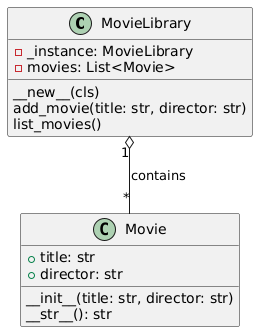

## Львівський Національний Університет Природокористування
## Кафедра Інформаційних систем та Технологій

### Звіт про виконання лабораторної роботи №11
# "Твірні шаблони проєктування"

| Виконала: студентка групи ІТ-31Прендота Анна |
|----------------------------------------------|
| Перевірив: Татомир А.В.               |

**Мета: познайомитися з групою твірних шаблонів проектування.**

Хід роботи

1. Дати теоретичной опис твірної групи шаблонів
2. Навести приклад коду який реалізовує даний шаблон
3. Скласти його UML-діаграму 

[Практична робота №11](https://github.com/KhrystynaLutsiv/IT-21_OOP/blob/master/Anna_Prendota/lab%2011/1) 

[UML-діаграма](https://github.com/KhrystynaLutsiv/IT-21_OOP/blob/master/Anna_Prendota/lab%2011/lab11.png)

## Висновки. 

На даній лабораторній роботі я ознайомилася з твірними шаблонами проєктування та навчилася використовувати їх на практиці. Це дало змогу зрозуміти, як створювати об'єкти ефективно та гнучко, забезпечуючи більшу масштабність і підтримку коду в проєках. 
