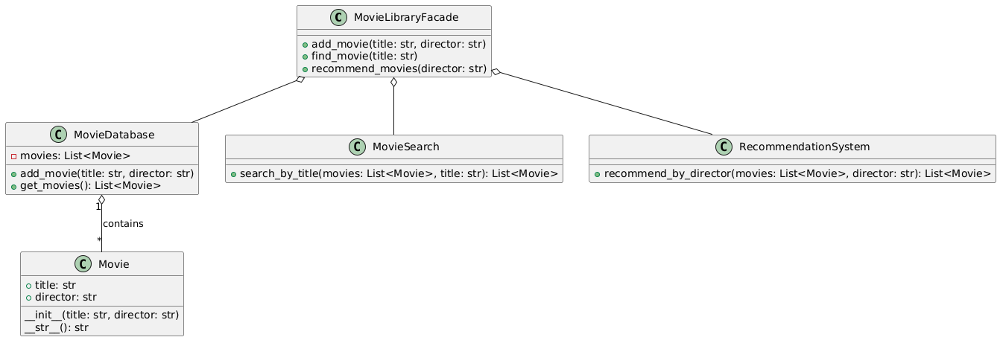

## Львівський Національний Університет Природокористування
## Кафедра Інформаційних систем та Технологій

### Звіт про виконання лабораторної роботи №12
# "Структурні шаблони проєктування"

| Виконала: студентка групи ІТ-31 Прендота Анна |
|----------------------------------------------|
| Перевірив: Татомир А.В.               |

**Мета: познайомитися з групою структурних шаблонів проектування.**

Хід роботи

1. Дати теоретичний опис структурної групи шаблонів.
2. Відповідно до индивідуального завдання:
- дати теоретичний опис даного шаблону;
- навести приклад коду який реалізовує даний шаблон;
- скласти його UML-діяграму. 

[Практична робота №12](https://github.com/KhrystynaLutsiv/IT-21_OOP/blob/master/Anna_Prendota/lab%2012/text.py)

 

UML-діаграма

## Висновки. 

На даній лабораторній роботі я ознайомилася зі структурними шаблонами проєктування та навчилася використовувати їх на практиці. Це дозволило зрозуміти, як організовувати взаємодію між класами та об'єктами, забезпечуючи більш ефективну структуру коду, підвищену гнучкість і спрощену підтримку в програмних проєктах. 
