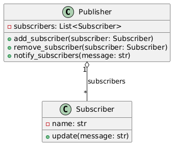

## Львівський Національний Університет Природокористування
## Кафедра Інформаційних систем та Технологій

### Звіт про виконання лабораторної роботи №13
# "Поведінкові шаблони проєктування"

| Виконала: студентка групи ІТ-31 Прендота Анна |
|----------------------------------------------|
| **Перевірив: Татомир А.В.**               |

**Мета: познайомитися з групою поведінкових шаблонів проектування.**

Хід роботи

1. Дати теоретичний опис поведінкової групи шаблонів.
2. Відповідно до індивідуального завдання:
- дати теоретичний опис даного шаблону;
- навести приклад коду який реалізовує даний шаблон;
- скласти його UML-діяграму.

**Опис шаблону**

Шаблон проектування "Спостерігач" (Observer) належить до поведінкових шаблонів і використовується для реалізації механізму, при якому один об'єкт (суб'єкт) може сповіщати інші об'єкти (спостерігачі) про зміни свого стану. Цей шаблон дозволяє зменшити зв'язність між об'єктами, що робить систему більш гнучкою і легкою для розширення.

Основні характеристики:
Суб'єкт (Subject):

Це об'єкт, який спостерігається. Він управляє списком спостерігачів, які підписалися на отримання повідомлень про зміни.
Суб'єкт має методи для додавання та видалення спостерігачів, а також метод для сповіщення всіх зареєстрованих спостерігачів про зміни.

Спостерігач (Observer):
Це об'єкт, який реагує на зміни в суб'єкті. Спостерігач реалізує інтерфейс, що визначає метод, який буде викликаний суб'єктом, коли його стан змінюється.
Кожен спостерігач отримує інформацію про зміни через метод, який викликається суб'єктом.

Основні переваги:

Зменшення зв'язності: Суб'єкт і спостерігачі можуть змінюватись незалежно один від одного. Спостерігачі не повинні знати, як реалізовано суб'єкт, лише те, що вони отримують сповіщення.

Динамічна взаємодія: Спостерігачі можуть бути додані або видалені в будь-який момент, що дозволяє динамічно змінювати поведінку системи.

Спрощена логіка: Завдяки використанню шаблону "Спостерігач" складні системи можна реалізувати більш просто, розділяючи відповідальності між різними об'єктами.

Коли використовувати:
Коли одна частина програми повинна реагувати на зміни в іншій частині (наприклад, в UI).
Коли потрібно зменшити зв'язність між об'єктами, які взаємодіють один з одним.
Коли є кілька об'єктів, які повинні отримувати однакові оновлення про зміни.

**Опис коду**

Цей код реалізує шаблон проектування "Спостерігач" (Observer), який дозволяє об'єктам (спостерігачам) реагувати на події або зміни в іншому об'єкті (суб'єкті). У цьому випадку реалізовані класи Publisher та Subscriber, які демонструють механізм підписки та отримання повідомлень.

1. Клас Publisher

Конструктор __init__:
Ініціалізує порожній список subscribers, який буде використовуватись для зберігання об'єктів-спостерігачів.

Метод add_subscriber:
Приймає об'єкт subscriber як параметр та додає його до списку підписників.

Метод remove_subscriber:
Приймає об'єкт subscriber і видаляє його зі списку підписників.

Метод notify_subscribers:
Приймає повідомлення (message) як параметр та проходить через усіх підписників у списку, викликаючи метод update для кожного з них. Це дозволяє спостерігачам отримувати оновлення.

2. Клас Subscriber

Конструктор __init__:
Ініціалізує атрибут name, який містить ім'я підписника.

Метод update:
Приймає повідомлення як параметр та виводить на екран повідомлення з ім'ям підписника, щоб підтвердити отримання повідомлення.

3. Тестування

Створення об'єкта Publisher:
Ініціалізується об'єкт класу Publisher, який буде відправляти повідомлення.

Створення підписників:
Створюються два об'єкти класу Subscriber: subscriber1 і subscriber2 з відповідними іменами.

Додавання підписників:
Обидва підписники додаються до списку підписників у Publisher через метод add_subscriber.

Відправка повідомлення:
Викликається метод notify_subscribers з повідомленням "Нове повідомлення". Це викликає метод update у кожного підписника, і вони виводять повідомлення на екран.

[Практична робота №13](https://github.com/KhrystynaLutsiv/IT-21_OOP/blob/master/Anna_Prendota/lab%2013/text1)

 

UML-діаграма

## Висновки. 

На даній лабораторній роботі я ознайомилася з поведінковими шаблонами проєктування, які фокусуються на управлінні взаємодією між об'єктами та їхньою комунікацією. Я навчилася використовувати шаблони, такі як Observer, що дозволяє ефективно реалізувати механізм сповіщення підписників про зміни в стані об'єкта. Це підвищує гнучкість та масштабованість коду, дозволяючи легко додавати нові підписники та сповіщати їх без значних змін у структурі програми. Застосування поведінкових шаблонів сприяє покращенню підтримки та розширюваності програмних проєктів.
