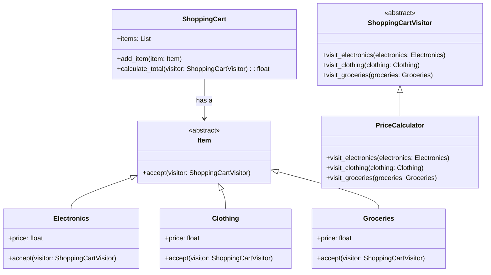

## Львівський Національний Університет Природокористування
## Кафедра Інформаційних систем та Технологій

### Звіт про виконання лабораторної роботи №13
# "Поведінкові шаблони проектування"

| Виконав: студент групи ІТ-31 Данило Чавс     |
|----------------------------------------------|
| Перевірив: Татомир А.В.                      |

**Мета: познайомитися з групою поведінкових шаблонів проєктування.**

Завдання

1. Дати теоретичний опис поведінкової групи шаблонів.
2. Відповідно до индивідуального завдання:
- дати теоретичний опис даного шаблону;
- навести приклад коду який реалізовує даний шаблон;
- скласти його UML-діяграму.

**Опис поведінкової групи шаблонів**

Поведінкові шаблони проектування - це група 
шаблонів, які допомагають налаштувати взаємодію
між об'єктами в системі. Вони вирішують задачі 
комунікації між об'єктами, керування станом програми
та поведінкою об'єктів, щоб забезпечити гнучкість і 
зручність розгирення коду.

Visitor — це поведінковий шаблон проектування, 
який дозволяє додавати нові операції до об'єктів 
без зміни їхніх класів. Він досягається шляхом 
передачі операцій об'єктам через спеціальний 
об'єкт — «відвідувач».

**Опис коду**

Патерн Visitor: Тут ShoppingCartVisitor визначає інтерфейс відвідувача, 
а PriceCalculator — конкретний відвідувач, який обчислює ціну для різних товарів за конкретними правилами.

Елементи: Item — базовий клас для товарів, з Electronics, Clothing і Groceries як конкретними реалізаціями.

Кошик для покупок: Клас ShoppingCart містить товари та використовує відвідувача для розрахунку загальних цін.

Рисунок UML діаграми 

## Висновки. 

На даній лабораторній роботі я ознайомився з групою поведінкових 
шаблонів проектування, зокрема з шаблоном visitor . Під час 
виконання роботи я навчився розділяти поведінку об'єкта на різні 
стани, що дозволяє динамічно змінювати логіку виконання залежно 
від поточного стану.
