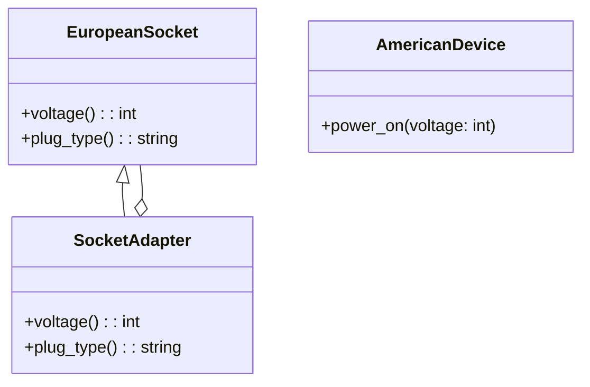

## Львівський Національний Університет Природокористування
## Кафедра Інформаційних систем та Технологій

### Звіт про виконання лабораторної роботи №12
# "Структурні шаблони проектування"

| Виконав: студент групи ІТ-31 Мельніцький Д. В.|
|-----------------------------------------------|
| Перевірив: Татомир А. В.                      | 

**Мета: познайомитися з групою структурних  шаблонів проєктування.**

### **Структурні шаблони**
Структурні патерни — це група шаблонів проектування, які допомагають організувати класи та об'єкти у великі структури, зберігаючи при цьому гнучкість та масштабованість. Вони дозволяють розподіляти відповідальність між класами та об'єктами, створюючи стійкі та зрозумілі системи.

### **Метод Adapter**
Адаптер — це структурний шаблон проектування, який дозволяє об'єктам з несумісними інтерфейсами працювати разом. Адаптер виконує роль посередника, який перетворює один інтерфейс в інший, щоб об'єкти могли взаємодіяти, не змінюючи їхній код.

Цей код реалізовує шаблон адаптера (Adapter Pattern), який дозволяє об'єктам з несумісними інтерфейсами працювати разом.

UML-ДІАГРАМА

Діаграма стосується [коду.](./12.patern_adapter.py)

