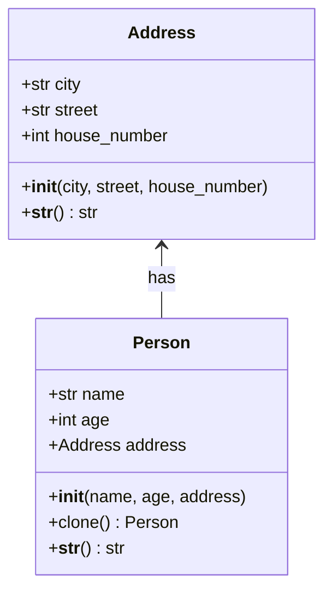

## Львівський Національний Університет Природокористування
## Кафедра Інформаційних систем та Технологій

### Звіт про виконання лабораторної роботи №11
# "Твірні шаблони проектування"

| Виконав: студент групи ІТ-31 Геврик Юрій     |
|----------------------------------------------|
| Перевірив: Татомир Андрій Володимирович      |

**Мета: познайомитися з групою твірних шаблонів проєктування.**

Завдання

1. Дати теоретичний опис твірної групи шаблонів.
2. Відповідно до индивідуального завдання:
- дати теоретичний опис даного шаблону;
- навести приклад коду який реалізовує даний шаблон;
- скласти його UML-діаграму.

1) Твірна група шаблонів — це набір шаблонів, які 
зосереджуються на процесі створення об'єктів. 
Вони дозволяють створювати об'єкти таким чином, 
щоб код не залежав від конкретного класу або типу, 
спрощуючи модифікацію та розширення системи.

2) Прототип — дозволяє створювати нові об'єкти шляхом 
копіювання існуючих. Він застосовується в тих випадках, 
коли створення нових об'єктів за допомогою конструктора 
є дорогим або складним процесом, і простіше створювати 
нові екземпляри через клонування вже існуючих об'єктів. 
Основна ідея полягає в тому, що об'єкт сам відповідає 
за своє клонування.

UML-ДІАГРАМА:

Запитання для самоконтролю:
1. Що таке твірні шаблони?
2. Які твірні шаблони Вам відомі?
3. Поясніть як реалізовано шаблон у Вашому прикладі.

Відповіді:

1)Твірні шаблони — це шаблони проєктування, 
які абстрагують процес створення об'єктів, 
роблячи систему незалежною від конкретних класів, 
що створюються. Вони забезпечують гнучкість у 
виборі об'єктів, які потрібно створювати, 
і полегшують підтримку та масштабованість коду 

2) Твірні шаблони: Фабричний метод, абстрактна фабрика, 
будівельник, прототип, одинак.

3) Шаблон реалізовано через метод clone(), який 
використовує функцію copy.deepcopy(self) для 
створення повністю незалежної копії об'єкта, 
включно з вкладеними об'єктами (наприклад, класу Address).

Коли змінюються дані в клоні (ім'я та місто), 
це не впливає на оригінальний об'єкт, що підтверджується 
перевіркою (результат False для перевірки об'єктів і адрес). 
Це показує, що клон і оригінал є незалежними об'єктами.

## Висновок: 

На даній лабораторній я познайомився з групою твірних шаблонів проєктування.