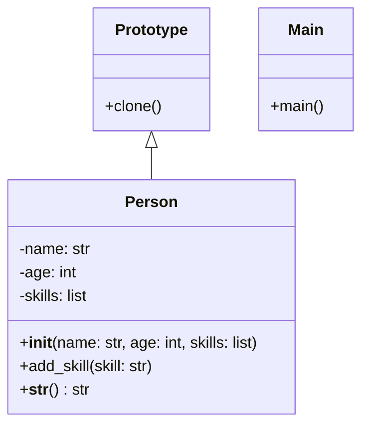

## Львівський Національний Університет Природокористування
## Кафедра Інформаційних Cистем та Технологій

### Звіт про виконання лабораторної роботи №11
# "Твірні шаблони проектування"

| **Виконав: студент групи ІТ-31 Юрій Геврик** |
|----------------------------------------------|
| **Перевірив: Татомир А. В.**                 |

**Мета: познайомитися з групою твірних шаблонів проєктування.**

Завдання:

1. Дати теоретичний опис твірної групи шаблонів.
2. Відповідно до індивідуального завдання:
- дати теоретичний опис даного шаблону;
- навести приклад коду який реалізовує даний шаблон;
- скласти його UML-діаграму.

**Опис твірної групи шаблонів**

Твірні шаблони — це шаблони проєктування, 
що абстрагують процес побудови об'єктів. 
Вони допоможуть зробити систему незалежною 
від способу створення, композиції та 
представлення її об'єктів.

Шаблон, який породжує класи, використовує 
успадкування, щоб варіювати створюваний клас, 
а шаблон, що створює об'єкти, делегує інстанціювання 
іншому об'єктові.

Ці шаблони важливі, коли система більше залежить від 
композиції об'єктів, ніж від успадкування класів

Прототип — твірний шаблон проєктування, який дозволяє 
створювати копії існуючих об'єктів таким чином, що 
програмний код не залежить від їх класів.

Цей шаблон застосовують у випадку, коли тип об'єктів, 
що створюються заданий екземпляром прототипу, 
що використовується для створення нових об'єктів 
шляхом копіювання цього прототипу. 

**Опис коду**

**Імпорт модуля copy:** використовується для виконання 
копіювання, що створює повністю незалежні копії об'єктів.

**Клас Prototype:** містить метод clone, який виконує глибоке 
копіювання об'єкта за допомогою функції copy.deepcopy().

**Клас Person:** наслідується від класу Prototype. Він:

Ініціалізується з трьома атрибутами: name, age, і skills.
Має метод add_skill, який додає нову навичку до списку.
Метод __str__ використовується для виведення об'єкта у зручному форматі.

Створюється об'єкт original_person з іменем "John", віком 30 і навичками ["Python", "Django"].
Виводиться інформація про цей об'єкт.
Створюється копія original_person під назвою cloned_person за допомогою методу clone.
До копії додається нова навичка "JavaScript" і змінюється ім'я на "Mike".
Виводяться дані як для клонованого об'єкта, так і для оригіналу, щоб показати, що оригінал залишився незмінним.

UML діаграма на основі [коду.](./1.py)

##Висновок:

На лабораторній роботі я навчився реалізовувати 
патерн проектування Прототип. Використовуючи модуль 
copy та функцію deepcopy, я зрозумів, як можна 
створювати незалежні копії об'єктів. 
Завдяки цьому, будь-які зміни, внесені в 
клонований об'єкт, не впливають на оригінал.

