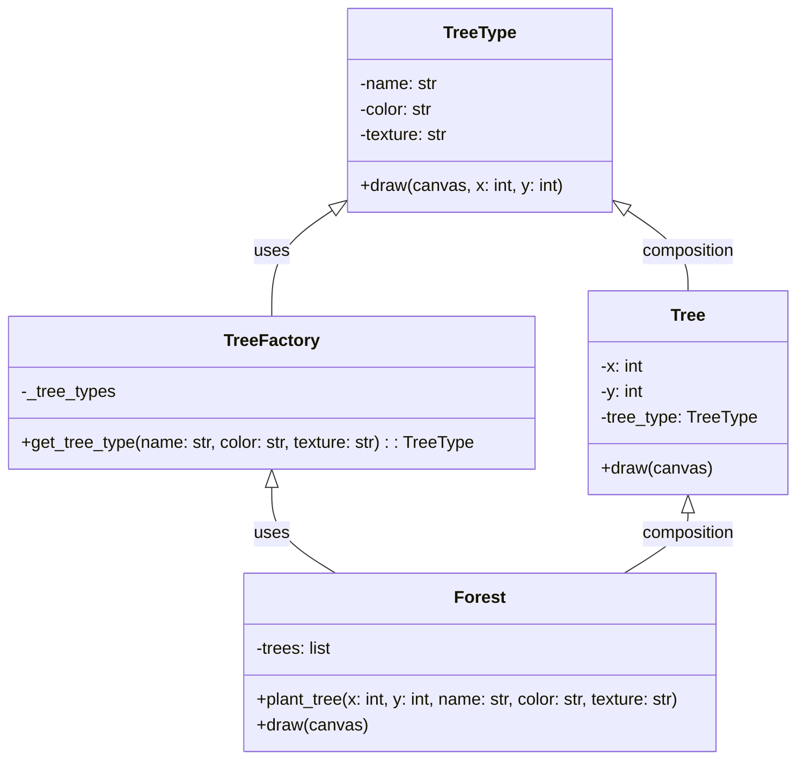

## Львівський Національний Університет Природокористування
## Кафедра Інформаційних Систем та Технологій

### Звіт про виконання лабораторної роботи №12
# "Структурні шаблони проектування"

| **Виконав: студент групи ІТ-31 Юрій Геврик** |
|----------------------------------------------|
| **Перевірив: Татомир А. В.**                 |

**Мета: познайомитися з групою структурних шаблонів проєктування.**

Завдання:

1. Дати теоретичний опис структурної групи шаблонів.
2. Відповідно до індивідуального завдання:
- дати теоретичний опис даного шаблону;
- навести приклад коду який реалізовує даний шаблон;
- скласти його UML-діаграму.

**Опис структурної групи шаблонів**

Структурні шаблони — шаблони проєктування, 
у яких розглядається питання про те, як із 
класів та об'єктів утворюються більші за 
розмірами структури.

Структурні шаблони рівня класу використовують 
успадкування для утворення композицій із 
інтерфейсів та реалізацій.

Структурні шаблони рівня об'єкта компонують 
об'єкти для отримання нової функціональності. 
Додаткова гнучкість у цьому разі пов'язана з 
можливістю змінювати композицію об'єктів під 
час виконання, що є неприпустимим для статичної 
композиції класів.

Легковаговик— шаблон проєктування, за яким створюється 
об'єкт, що мінімізує використання пам'яті розподіляючи 
стільки даних скільки це можливо між іншими подібними 
об'єктами; це спосіб використання великої кількості 
об'єктів, коли просте повторювання їх представлення 
зайняло б велику кількість пам'яті

**Опис коду**

**Клас TreeType:**

Представляє тип дерева з атрибутами name, color та texture.
Метод draw() малює дерево певного типу на вказаній позиції (x, y) на полотні canvas.

**Клас TreeFactory:**

Це фабрика, що створює та зберігає унікальні типи дерев.
Метод get_tree_type() приймає три параметри — назву, 
колір і текстуру дерева — і повертає об'єкт типу TreeType. 
Якщо такий тип дерева вже існує, він повертає наявний 
об'єкт з кешу (_tree_types), інакше створює новий.

**Клас Tree:**

Представляє окреме дерево з координатами x і y, і має посилання на об'єкт TreeType.
Метод draw() малює дерево на полотні, використовуючи метод draw() відповідного типу дерева.

**Клас Forest:**

Містить колекцію дерев у лісі.
Метод plant_tree() додає нове дерево до лісу, використовуючи фабрику для отримання типу дерева.
Метод draw() малює всі дерева в лісі на вказаному полотні.

UML діаграма на основі [коду.](./2.py)

##Висновок:

На лабораторній роботі я навчився реалізовувати патерн 
"Легковаговик" для оптимізації використання пам'яті за 
рахунок спільного використання об'єктів. Використовуючи 
клас TreeFactory, я зрозумів, як можна зберігати унікальні 
дані в окремих об'єктах, а загальні властивості, повторно 
використовувати, зменшуючи кількість створюваних екземплярів. 
Це допомагає ефективніше управляти ресурсами в програмах 
з великим обсягом однакових елементів.

