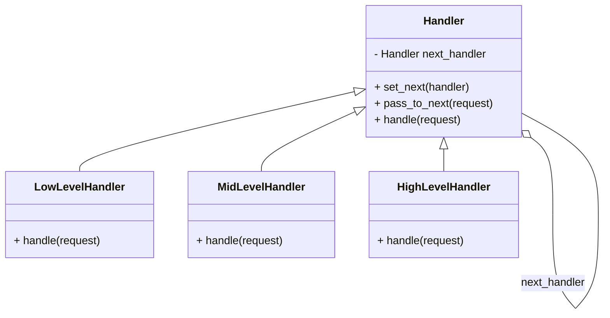

## Львівський Національний Університет Природокористування
## Кафедра Інформаційних Систем та Технологій

### Звіт про виконання лабораторної роботи №13
# "Поведінкові шаблони проектування"

| **Виконав: студент групи ІТ-31 Юрій Геврик** |
|----------------------------------------------|
| **Перевірив: Татомир А. В.**                 |

**Мета: познайомитися з групою поведінкових шаблонів проєктування.**

Завдання:

1. Дати теоретичний опис поведінкових групи шаблонів.
2. Відповідно до індивідуального завдання:
- дати теоретичний опис даного шаблону;
- навести приклад коду який реалізовує даний шаблон;
- скласти його UML-діаграму.

**Опис поведінкової групи шаблонів**

Поведінкові шаблони — шаблони проєктування, що пов'язані 
з алгоритмами та розподілом обов'язків поміж об'єктів. 
Мова в них йде не тільки про самі об'єкти та класи, але 
й про типові способи їхньої взаємодії. Шаблони поведінки 
характеризують складний потік керування, котрий досить 
важко прослідкувати під час виконання програми.

Ланцюжок відповідальностей —  шаблон, який складається 
з об'єктів «команда» і серії об'єктів-виконавців. 
Кожен об'єкт-виконавець має логіку, що описує типи 
об'єктів «команда», які він може обробляти, а також 
як передати далі ланцюжком ті об'єкти-команди, що він 
не може обробляти. Крім того існує механізм для додавання 
нових призначених для обробки об'єктів у кінець ланцюжка.

**Опис коду**

**Абстрактний клас Handler:**

Використовується як базовий клас для обробників, 
що реалізують ланцюжок обов'язків (Chain of Responsibility).
Метод handle є абстрактним (визначається через декоратор 
@abstractmethod), тому кожен нащадок класу має реалізувати цей метод для обробки запитів.
Метод set_next дозволяє встановити наступного обробника у ланцюжку.
Метод pass_to_next передає запит наступному обробнику, якщо поточний не може його обробити.

**Класи-нащадки:**

LowLevelHandler: обробляє запити, де значення менше ніж 10.
MidLevelHandler: обробляє запити зі значеннями від 10 до 50.
HighLevelHandler: обробляє запити зі значенням більше або рівним 50.
Кожен із цих класів спочатку намагається обробити запит, 
і якщо не може, передає його наступному обробнику через метод pass_to_next.

**Ланцюжок обробників:**

Створюються три обробники: LowLevelHandler, MidLevelHandler, HighLevelHandler.
Ланцюжок будується за допомогою методу set_next: 
спочатку LowLevelHandler, потім MidLevelHandler, і нарешті HighLevelHandler.

**Процес обробки запитів:**

Запити обробляються по черзі. Кожен запит передається першому 
обробнику (LowLevelHandler), і якщо він не може обробити запит, він передає його наступним по ланцюжку.
Приклад обробки: запити [5, 20, 75, 45] розподіляються між обробниками відповідно до їх діапазонів.

UML діаграма на основі [коду.](./3.py)

##Висновок:

На цій лабораторній роботі я навчився реалізовувати 
патерн "Ланцюжок обов'язків", який дозволяє передавати 
запити по ланцюгу обробників до тих пір, поки один із 
них не зможе його обробити. Це забезпечує гнучкість у 
виборі обробника без необхідності жорсткої прив'язки 
до конкретного класу. Такий підхід спрощує розширення 
і підтримку коду, дозволяючи легко додавати нові рівні 
обробки запитів.

