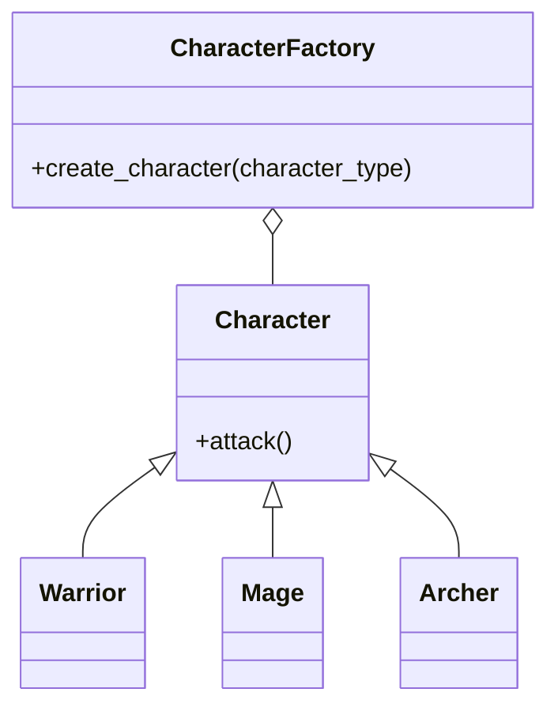

## Львівський Національний Університет Природокористування
## Кафедра Інформаційних систем та Технологій

### Звіт про виконання лабораторної роботи №11
# "Твірні шаблони проектування"

| Виконав: студент групи ІТ-31 Кулішов Назар     |
|----------------------------------------------|
| Перевірив: Татомир Андрій Володимирович      |

**Мета: познайомитися з групою твірних шаблонів проєктування.**

*Завдання*

1. Дати теоретичний опис твірної групи шаблонів.
2. Відповідно до индивідуального завдання:
- дати теоретичний опис даного шаблону;
- навести приклад коду який реалізовує даний шаблон;
- скласти його UML-діяграму.

**Опис**
 
 Твірна група шаблонів, також відома як шаблонна група або група породжуючих елементів шаблонів, є важливою концепцією в області теорії шаблонів у комп'ютерних науках та програмуванні. Теоретичний опис цієї групи включає вивчення, як шаблони структурно організовуються і як їх можна комбінувати для досягнення складніших систем або алгоритмів.
 Основні елементи теорії шаблонів:
Шаблон як абстракція: Шаблон — це повторюваний структурний або поведінковий елемент, який вирішує певну задачу або описує рішення певної проблеми в заданому контексті.
 Твірна група: Твірна група шаблонів складається з множини базових шаблонів, які породжують інші шаблони або рішення шляхом комбінування. Це схоже на породжуючі елементи в математичних групах, де група породжується з базових елементів за допомогою комбінацій операцій.
  Компоненти твірної групи шаблонів:
 Породжуючі елементи: Це базові шаблони, які можна комбінувати для отримання нових шаблонів. Наприклад, у розробці програмного забезпечення породжуючими елементами можуть бути архітектурні або структурні шаблони.
 Операції комбінування: Це способи, якими шаблони комбінуються для досягнення більш складних конструкцій. До таких операцій можуть належати композиція, наслідування, делегування, що дозволяють будувати нові шаблони з існуючих.
 Простір шаблонів: Це множина всіх можливих шаблонів, які можна утворити з комбінації базових шаблонів. Простір є кінцевим або нескінченним в залежності від правил комбінування та обмежень.
Factory Method (Фабричний метод):
Цей патерн використовується для створення об'єктів без вказування конкретних класів об'єктів, які необхідно створити. Він дозволяє підкласам вирішувати, який тип об'єкта створювати, забезпечуючи більш гнучку структуру коду.
Слід використовувати шаблон Фабричний метод коли:
класу не відомо заздалегідь, об'єкти яких саме класів йому потрібно створювати;
клас спроєктовано так, щоб об'єкти, котрі він створює, специфікувалися підкласами;
клас делегує свої обов'язки одному з кількох допоміжних підкласів, та потрібно локалізувати знання про те, який саме підклас приймає ці обов'язки на себе.

*Умови завдання*

Є базовий клас Character з абстрактним методом attack().
Для кожного типу персонажа створюється свій клас, що наслідується від Character і реалізує метод attack() по-своєму.
Необхідно реалізувати клас CharacterFactory з фабричним методом create_character(character_type), який повертатиме відповідний тип персонажа залежно від параметра character_type (Warrior, Mage, Archer).
Використайте фабрику для створення персонажа, що вибирається гравцем, та викличте метод attack() для перевірки, чи створюється персонаж правильно.

UML-Діаграма  [->](./lab11.py)

*Основні елементи*

Базовий клас Character — містить метод attack(), який мають реалізувати всі персонажі.
Конкретні класи персонажів:
Warrior: атака мечем.
Mage: магічна атака.
Archer: стріляє з лука.
Фабрика CharacterFactory — має метод create_character(), який створює і повертає об'єкт персонажа залежно від типу (Warrior, Mage або Archer).
Як це працює:
Гравець вибирає тип персонажа.
Фабрика створює відповідного персонажа і повертає його.
Викликається метод attack() цього персонажа для виконання дії.

## Висновки

У цій лабораторній роботі я дізнався що таке твірні шаблони в проектуванні створив невеличку програму на прикладі гри за допомогою фабричного методу.

