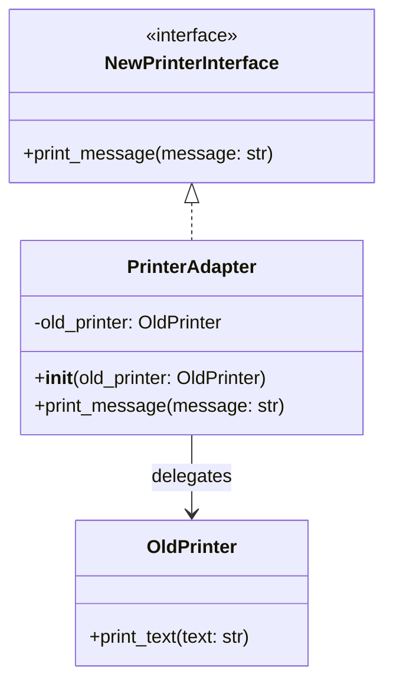

## Львівський Національний Університет Природокористування
## Кафедра Інформаційних систем та Технологій

### Звіт про виконання лабораторної роботи №12
# "Структурні шаблони проектування"

| Виконав: студент групи ІТ-31 Юрій Мавко      |
|----------------------------------------------|
| Перевірив: Татомир А.В.                      |

**Мета: познайомитися з групою структурних шаблонів проєктування.**

Завдання

1. Дати теоретичний опис структурної групи шаблонів.
2. Відповідно до индивідуального завдання:
- дати теоретичний опис даного шаблону;
- навести приклад коду який реалізовує даний шаблон;
- скласти його UML-діяграму.

**Опис структурної групи шаблонів**

Структурна група шаблонів проектування - це набір 
шаблонів, які визначають способи побудови відносин 
між класами та об’єктами. Вони допомагають об'єднувати 
елементи системи в єдине ціле, спрощують структуру коду 
та підвищують гнучкість. Основна мета таких шаблонів – 
полегшити роботу з класами та об'єктами, зробити систему 
зрозумілішою, легшою для розширення та підтримки.

Шаблон проектування Адаптер (Adapter) – це структурний 
патерн, який дозволяє об'єднувати об'єкти або системи з 
різними інтерфейсами для спільної роботи. Він виступає 
посередником між двома несумісними об'єктами, забезпечуючи 
їхню взаємодію без необхідності змінювати їхню внутрішню 
реалізацію. Адаптер переводить інтерфейс одного класу в 
інтерфейс, який очікує інший клас, роблячи їх сумісними. 
Це дозволяє повторно використовувати наявні класи, які не 
можна змінити, в нових системах, які мають інші вимоги. 
Завдяки цьому патерну зменшується кількість змін у коді, 
що робить систему гнучкішою і легшою для підтримки.

**Опис коду**

Клас **OldPrinter** представляє старий принтер, який має метод print_text, що виконує друк тексту у стандартному форматі.

**NewPrinterInterface** є новим інтерфейсом для принтерів, що визначає метод print_message, але не реалізує його.

Клас **PrinterAdapter** реалізує новий інтерфейс, приймаючи об'єкт старого принтера в своєму конструкторі. Він забезпечує адаптацію, викликаючи метод print_text старого принтера через метод print_message, що дозволяє використовувати старий принтер з новим інтерфейсом.

Функція **client_code** приймає принтер (який може бути будь-яким, що реалізує новий інтерфейс) і викликає метод print_message, передаючи текст для друку.

Рисунок UML діаграми на основі [коду.](./adapter.py)

## Висновки. 

На даній лабораторній роботі я ознайомився з групою структурних 
шаблонів проектування, зокрема із шаблоном Адаптер. Під час виконання 
роботи я навчився інтегрувати старі класи в нові системи, не змінюючи 
їхню внутрішню реалізацію, що дозволяє забезпечити сумісність між 
різними інтерфейсами. Це підвищує гнучкість та модульність програмного 
коду, оскільки дозволяє повторно використовувати існуючі компоненти в 
нових контекстах. 
