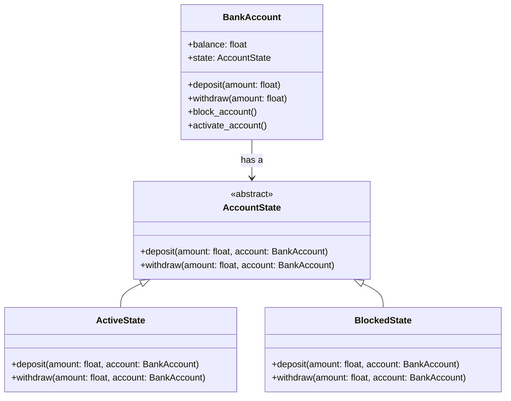

## Львівський Національний Університет Природокористування
## Кафедра Інформаційних систем та Технологій

### Звіт про виконання лабораторної роботи №13
# "Поведінкові шаблони проектування"

| **Виконав: студент групи ІТ-31 Юрій Мавко**  |
|----------------------------------------------|
| **Перевірив: Татомир А. В.**                 |

**Мета: познайомитися з групою поведінкових шаблонів проєктування.**

Завдання

1. Дати теоретичний опис поведінкової групи шаблонів.
2. Відповідно до индивідуального завдання:
- дати теоретичний опис даного шаблону;
- навести приклад коду який реалізовує даний шаблон;
- скласти його UML-діяграму.

**Опис поведінкової групи шаблонів**

Поведінкові шаблони проектування - це група 
шаблонів, які допомагають налаштувати взаємодію
між об'єктами в системі. Вони вирішують задачі 
комунікації між об'єктами, керування станом програми
та поведінкою об'єктів, щоб забезпечити гнучкість і 
зручність розгирення коду.

Поведінковий шаблон проектування Стан (state)
використовується для управління поведінкою об'єкта,
що змінюється в залежності від його поточного стану.
Основна ідея цього шаблону полягає в тому, щоб винести 
логіку поведінки об'єкта в окремі класи, які 
представляють різні стани і дозволити об'єкту змінювати
свій стан динамічно.

**Опис коду**

Клас **AccountState** є абстрактним класом, що визначає 
інтерфейс для різних станів рахунка. Він містить два 
абстрактних методи: deposit та withdraw, які мають реалізувати 
конкретні стани рахунка.

**ActiveState** – це клас, що реалізує активний стан рахунка. 
Він дозволяє вносити кошти через метод deposit та знімати 
кошти через метод withdraw. Якщо зняття коштів перевищує 
доступний баланс, виводиться повідомлення про недостатність коштів.

**BlockedState** – це клас, що реалізує заблокований стан рахунка. 
У цьому стані не можна здійснювати ні вклади, ні зняття коштів. 
Всі спроби внести або зняти гроші призводять до відповідних повідомлень.

Клас **BankAccount** представляє сам банківський рахунок. Він має 
атрибути balance (баланс) та state (стан), який за замовчуванням 
встановлено в ActiveState. Метод deposit дозволяє внести кошти, 
викликаючи відповідний метод стану. Метод withdraw дозволяє зняти 
кошти. Методи block_account і activate_account змінюють стан 
рахунка на заблокований або активний відповідно.

Рисунок UML діаграми на основі [коду.](./state.py)

## Висновки. 

На даній лабораторній роботі я ознайомився з групою поведінкових 
шаблонів проектування, зокрема з шаблоном Стан (State). Під час 
виконання роботи я навчився розділяти поведінку об'єкта на різні 
стани, що дозволяє динамічно змінювати логіку виконання залежно 
від поточного стану. Це значно спростило реалізацію класу 
банківського рахунка, оскільки кожен стан (активний чи заблокований) 
має свою унікальну поведінку при виконанні операцій з вкладанням 
і зняттям коштів.
