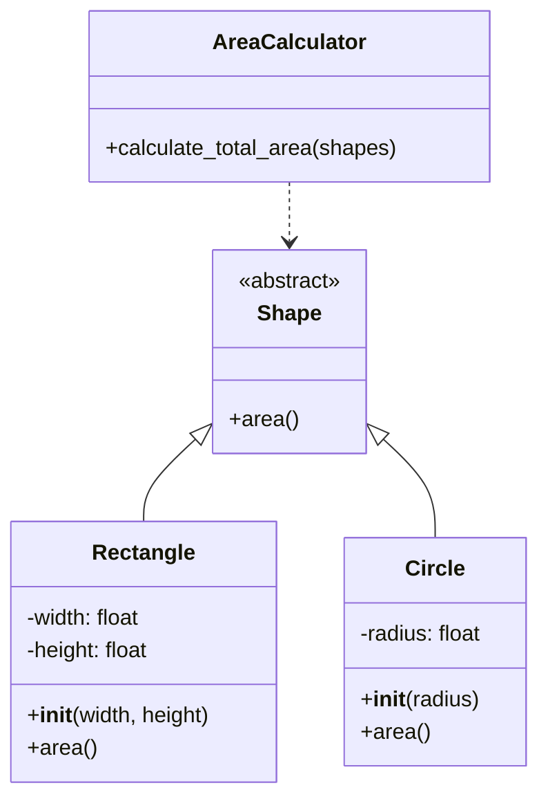

## Львівський Національний Університе Природокористування
## Кафедра інформаційних систем та технологій

### Звіт про виконання лабораторної роботи №4
# "Принципи SOLID: Принцип єдиної відповідальності"

| Виконав: Студент групи : ІТ-31 Пасемко Василь |
|-----------------------------------------------|
| Перевірив: Татомир Андрій                     |

**Мета: познайомитися з найбільш поширеними сучасними принципами проєктування програмного забезпечення.**

**Завдання:**
1. Дати загальний опис принципів проєктування. 
2. Дати детальний опис одного із принципів SOLID з наведення прикладу коду.

## Принципи SOLID

SOLID - це набір з п'яти принципів проєктування, сформульованих Робертом Мартіном. Ці принципи орієнтовані на поліпшення структури програмного забезпечення, підвищення його гнучкості та мінімізацію помилок.

1. **Single Responsibility Principle (SRP) – Принцип єдиної відповідальності**
   - Клас повинен мати лише одну причину для змін, тобто відповідати лише за одну функцію.
   - Приклад: Клас, який обробляє дані користувача, не повинен займатися логікою їх відображення.

2. **Open/Closed Principle (OCP) – Принцип відкритості/закритості**
   - Програмні сутності (класи, модулі, функції) повинні бути відкритими для розширення, але закритими для змін.
   - Приклад: Замість зміни існуючого класу додаються нові класи, що реалізують інтерфейси.

3. **Liskov Substitution Principle (LSP) – Принцип підстановки Барбари Лісков**
   - Об'єкти базового класу можуть бути замінені об'єктами його підкласів без порушення коректності роботи програми.
   - Приклад: Якщо у базовому класі є метод calculateArea(), підкласи повинні правильно його реалізувати, без змін інтерфейсу.

4. **Interface Segregation Principle (ISP) – Принцип розділення інтерфейсів**
   - Краще мати багато вузьких інтерфейсів, ніж один великий. Клас не повинен залежати від методів, які він не використовує.
   - Приклад: Замість одного інтерфейсу Device з методами print(), scan() і fax() можна створити три окремі інтерфейси для принтера, сканера і факса.

5. **Dependency Inversion Principle (DIP) – Принцип інверсії залежностей**
   - Модулі високого рівня не повинні залежати від модулів низького рівня; обидва повинні залежати від абстракцій.
   - Абстракції не повинні залежати від деталей, деталі повинні залежати від абстракцій.
   - Приклад: Замість створення об'єктів у класі напряму, використовується ін'єкція залежностей.

**Переваги SOLID:**
- Код стає більш зрозумілим і легшим у підтримці.
- Зменшується ризик виникнення помилок при зміні функціоналу.
- Полегшується тестування.

## Принцип відкритості/закритості (OCP)

Принцип відкритості/закритості стверджує, що програмні сутності (класи, модулі, функції) повинні бути відкритими для розширення, але закритими для модифікації. Це означає, що поведінку сутності можна розширити без зміни її вихідного коду.

### Як визначити, чи клас порушує OCP:

1. Якщо при додаванні нової функціональності потрібно змінювати існуючий код
2. Якщо умовні оператори (if/switch) використовуються для вибору поведінки
3. Якщо зміни в одному місці вимагають каскадних змін в інших частинах програми
4. Якщо новий функціонал не можна додати через успадкування або композицію

### Відповідність принципу OCP:

1. **Розширюваність без модифікації**
   - Новий функціонал додається через успадкування або композицію
   - Існуючий код залишається незмінним при додаванні нових можливостей

2. **Використання абстракцій**
   - Класи реалізують інтерфейси або абстрактні класи для розширення поведінки
   - Замість зміни існуючих класів, додаються нові, що реалізують необхідну функціональність

3. **Зменшення ризику помилок**
   - Зміни в одному місці не вимагають каскадних змін в інших частинах програми
   - Легше тестувати новий функціонал, оскільки він ізольований від існуючого коду

## Опис програми

Програма демонструє реалізацію  принципу єдиної відповідальності (SRP). Кожен клас відповідає за одну конкретну функцію, що робить код більш організованим та легшим для підтримки. Це класичний приклад правильного застосування принципу єдиної відповідальності.

### Структура програми:

[Реалізація OCP](main.py)

1. **Абстрактний клас Shape**
   - Визначає метод `area()`, який реалізують підкласи
   - Слугує базовим класом для різних фігур

2. **Клас Rectangle**
   - Реалізує метод `area()`, обчислюючи площу прямокутника
   - Містить поля для ширини та висоти

3. **Клас Circle**
   - Реалізує метод `area()`, обчислюючи площу кола
   - Містить поле для радіуса

4. **Клас AreaCalculator**
   - Відповідає за обчислення загальної площі набору фігур
   - Містить метод `calculate_total_area()`, що приймає список фігур

5. **Головна функція main()**
   - Створює екземпляри фігур (прямокутник та коло)
   - Виконує обчислення загальної площі
   - Виводить загальну площу на екран

### Відповідність принципу OCP:

1. **Розширюваність без модифікації**
   - Новий функціонал додається через успадкування або композицію
   - Існуючий код залишається незмінним при додаванні нових можливостей

2. **Використання абстракцій**
   - Класи реалізують інтерфейси або абстрактні класи для розширення поведінки
   - Замість зміни існуючих класів, додаються нові, що реалізують необхідну функціональність

3. **Зменшення ризику помилок**
   - Зміни в одному місці не вимагають каскадних змін в інших частинах програми
   - Легше тестувати новий функціонал, оскільки він ізольований від існуючого коду

### Переваги такої реалізації:

- Чітка та логічна структура класів
- Покращена читабельність коду 
- Покращена підтримка коду
- Гнучкість системи

### UML діаграма класів

## Висновок
Принципи проєктування SOLID, зокрема принцип відкритості/закритості (OCP), є фундаментальними для створення якісного програмного забезпечення. Застосування OCP дозволяє створювати гнучкі системи, які легко розширюються без необхідності змінювати існуючий код. Це значно зменшує ризики внесення помилок при додаванні нового функціоналу, спрощує тестування та підтримку коду. На практичному прикладі ми побачили, як правильне застосування OCP через використання абстракцій та успадкування дозволяє створювати масштабовані рішення, які легко адаптуються до нових вимог.