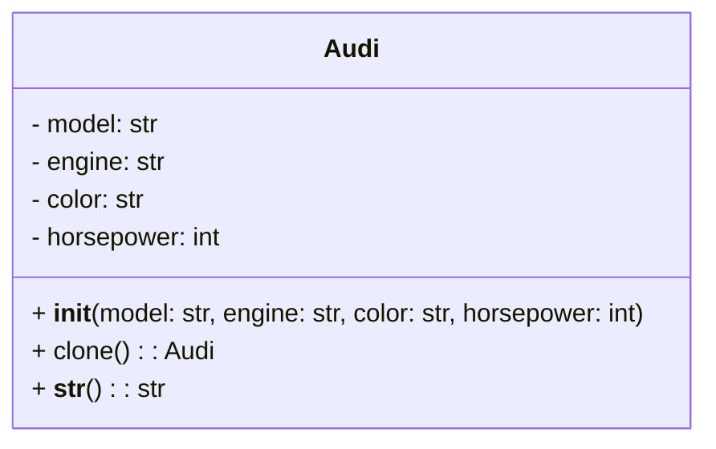

## Львівський Національний Університет Природокористування
## Кафедра Інформаційних систем та Технологій

### Звіт про виконання лабораторної роботи №11
# "Твірні шаблони проектування"

| Виконав: студент групи ІТ-31 Володимир Рекшинський  |
|-----------------------------------------------------|
| **Перевірив: Татомир А. В.**                        |

**Мета: познайомитися з групою твірних шаблонів проєктування.**

Завдання

1. Дати теоретичний опис твірної групи шаблонів.
2. Відповідно до индивідуального завдання:
- дати теоретичний опис даного шаблону;
- навести приклад коду який реалізовує даний шаблон;
- скласти його UML-діяграму.

Відповіді

Твірна група шаблонів - ці шаблони відповідають за процес створення об'єктів і спрощують їх ініціалізацію. Вони абстрагують спосіб інстанціювання об'єктів, що забезпечує незалежність коду від конкретних класів.

Prototype – це шаблон проектування, що належить до групи породжувальних шаблонів (Creational Patterns). Він дозволяє створювати нові об'єкти на основі вже існуючих, використовуючи механізм копіювання. Прототип використовується, коли процес створення об'єкта "з нуля" є складним або дорогим, а просте копіювання наявного об'єкта дає можливість швидше створювати нові екземпляри.

Шаблон Prototype дозволяє створювати об'єкти, не вказуючи їх класів, а лише копіюючи вже існуючий об'єкт (прототип). Це зменшує залежність від конкретних класів та спрощує створення об'єктів, особливо коли мова йде про складні або ресурсомісткі об'єкти.

Компоненти реалізації:
Клас Audi: є конкретним прототипом. Він має атрибути: model, engine, color, і horsepower, які визначають характеристики автомобіля .
Метод clone() реалізує функціональність клонування ,використовує copy.deepcopy(self) для створення повної копії об'єкта. 
Метод __str__()  містить інформацію про модель, двигун, колір і потужність автомобіля. 
Створення оригінального об'єкта:
original_audi = Audi("RS6", "4.0 TFSI V8", "чорний", 600)
print(f"Оригінал Audi RS: {original_audi}")
об'єкт original_audi   (Audi Rs6)

Клонування об'єкта:
cloned_audi = original_audi.clone()

Модифікація клону:
cloned_audi.color = "білий"
cloned_audi.model = "RS7"
cloned_audi.engine = "4.0 TFSI V8"
cloned_audi.horsepower = 605

Рисунок UML діаграми на основі [коду.](./Prototype.py)

## Висновки. 
На даній лабораторній роботі ми ознайомились з групою твірних шаблонів проектування, а саме з Prototype. Ці шаблони спрощують процес створення об'єктів та надають можливість інстанціювати об'єкти у більш гнучкий спосіб. Вони абстрагують механізм створення об'єктів, забезпечуючи незалежність коду від конкретних класів та спрощуючи його підтримку і розвиток.

Шаблон Prototype забезпечує простий спосіб створення нових об'єктів через їх копіювання. Це дозволяє економити ресурси на створенні об'єктів, особливо в тих випадках, коли об'єкти мають складну структуру або вимагають значних ресурсів для інстанціювання.

Додатково, ми ознайомились з процесом побудови UML-діаграм для ілюстрації архітектури класів, що допомогло візуалізувати структуру та взаємодію між об'єктами.

