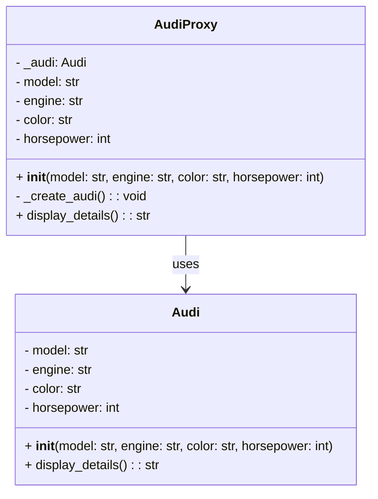

## Львівський Національний Університет Природокористування
## Кафедра Інформаційних систем та Технологій

### Звіт про виконання лабораторної роботи №12
# "Структурні шаблони проектування"

| Виконав: студент групи ІТ-31 Рекшинський Володимир |
|----------------------------------------------------|
| **Перевірив: Татомир А. В.**                       |

**Мета: познайомитися з групою структурних шаблонів проєктування.**

Завдання

1. Дати теоретичний опис структурної групи шаблонів.
2. Відповідно до индивідуального завдання:
- дати теоретичний опис даного шаблону;
- навести приклад коду який реалізовує даний шаблон;
- скласти його UML-діяграму.

Відповіді

Структурні шаблони проектування — це клас шаблонів, які зосереджені на тому, як об'єкти та класи можуть бути складені в більші структури для формування нових функціональних одиниць. Основною метою структурних шаблонів є спростити та оптимізувати способи організації класів і об'єктів, забезпечуючи таким чином гнучкість, повторне використання коду та полегшуючи підтримку системи

Proxy — це структурний шаблон проектування, який забезпечує замісник або "представника" для іншого об'єкта. Він контролює доступ до цього об'єкта і дозволяє виконувати деякі додаткові дії перед або після звернення до нього. Основна мета шаблону Proxy — це контроль за тим, як клієнти взаємодіють з реальними об'єктами, іноді обмежуючи доступ або додаючи функціонал.

Proxy є посередником між клієнтом і реальним об'єктом, представляючи той самий інтерфейс, що й реальний об'єкт. Проксі може керувати доступом до реального об'єкта або додавати логіку, яка виконується до або після взаємодії з цим об'єктом.

Опис коду:

Клас Audi:клас, який представляє об'єкт, що має атрибути model, engine, color і horsepower.
Метод display_details() виводить деталі автомобіля
Клас AudiProxy:контролює доступ до класу Audi.має атрибути для зберігання інформації про автомобіль (model, engine, color, horsepower) і для зберігання реального об'єкта Audi у _audi.
Метод _create_audi() перевіряє, чи створений об'єкт Audi. Якщо ні, він створює його з параметрами.
Метод display_details() викликає _create_audi(), щоб переконатися,чи об'єкт створено, перш ніж викликати його метод display_details().
У if __name__ == "__main__":створюється об'єкт audi_proxy класу AudiProxy з параметрами для автомобіля.

Рисунок UML діаграми на основі [коду.](./Proxy.py)

## Висновки. 
На даній лабораторній роботі ми ознайомились з групою структурних шаблонів проектування, зокрема з шаблоном Proxy. Цей шаблон дозволяє контролювати доступ до інших об'єктів, додаючи додатковий рівень абстракції або логіки без змін у самому об'єкті. Proxy надає можливість контролювати доступ до реального об'єкта, не змінюючи його поведінку, що дозволяє оптимізувати роботу системи та контролювати використання ресурсів.

Шаблон Proxy є корисним інструментом для ситуацій, де необхідно забезпечити додаткові перевірки або відкладене створення об'єктів. Він дозволяє знизити навантаження на систему та підвищити ефективність її роботи.

Додатково, ми ознайомились з процесом створення UML-діаграм, що дозволило нам краще зрозуміти, як Proxy взаємодіє з іншими об'єктами у системі, та візуалізувати взаємодію між різними компонентами.
