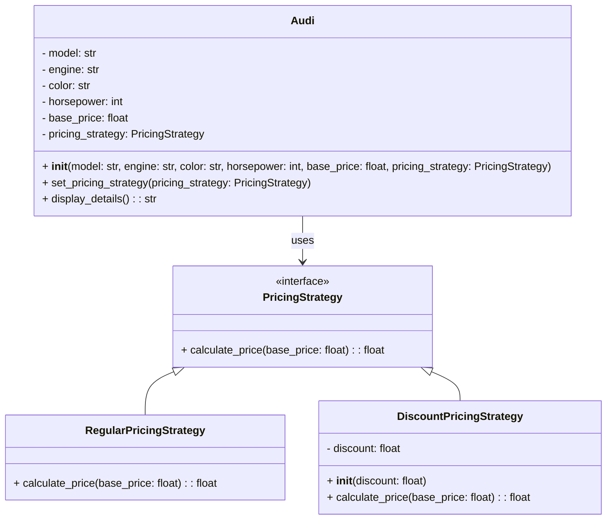

## Львівський Національний Університет Природокористування
## Кафедра Інформаційних систем та Технологій

### Звіт про виконання лабораторної роботи №13
# "Поведінкові шаблони проектування"

| Виконав: студент групи ІТ-31 Рекшинський Володимир |
|----------------------------------------------------|
| **Перевірив: Татомир А. В.**                       |

**Мета: познайомитися з групою поведінкових шаблонів проєктування.**

Завдання

1. Дати теоретичний опис поведінкової групи шаблонів.
2. Відповідно до индивідуального завдання:
- дати теоретичний опис даного шаблону;
- навести приклад коду який реалізовує даний шаблон;
- скласти його UML-діяграму.

Запитання для самоконтролю
1. Що таке поведінкові шаблони?
2. Які поведінкові шаблони Вам відомі?
3. Поясніть як реалізовано шаблон у Вашому прикладі.

Відповіді
Поведінкові шаблони проектування зосереджені на алгоритмах і розподілі відповідальності між об'єктами. Вони описують, як об'єкти взаємодіють і як їх поведінка може змінюватися в залежності від конкретних умов. Метою поведінкових шаблонів є спростити комунікацію між об'єктами, зменшуючи зв'язність і підвищуючи гнучкість системи.

Strategy" (Стратегія) Він визначає сімейство алгоритмів, інкапсулює їх і робить їх взаємозамінними. Це дозволяє клієнту вибирати алгоритм під час виконання програми. Шаблон "Strategy" дозволяє змінювати алгоритми незалежно від клієнтів, які їх використовують.

Компоненти реалізації:
Інтерфейс стратегії PricingStrategy:абстрактний клас, який визначає метод calculate_price(). 
RegularPricingStrategy: реалізує стандартну цінову стратегію.
DiscountPricingStrategy: реалізує цінову стратегію зі знижкою, а метод calculate_price() розраховує ціну з урахуванням знижки.
Клас Audi:представляє автомобіль, включає базову ціну та стратегію ціноутворення. 
Метод set_pricing_strategy() дозволяє змінювати стратегію ціноутворення в будь-який момент.
Метод display_details() викликає метод calculate_price() відповідної стратегії для отримання кінцевої ціни автомобіля.

Рисунок UML діаграми на основі [коду.](./Strategy.py)

## Висновки. 
На даній лабораторній роботі ми ознайомились з поведінковими шаблонами проектування, зокрема з шаблоном Strategy. Цей шаблон дозволяє динамічно змінювати поведінку об'єкта, використовуючи різні алгоритми (стратегії), не змінюючи його код. Шаблон Strategy сприяє гнучкості програми, оскільки дозволяє вибирати і змінювати алгоритми під час виконання програми.

Шаблон Strategy дозволяє розширювати функціональність програми без зміни її структури, забезпечуючи принцип відкритості/закритості (Open/Closed Principle). Він є ефективним рішенням у випадках, коли є потреба у частій зміні алгоритмів або їх варіантів.

Додатково, ми ознайомились з процесом побудови UML-діаграм, які допомогли візуалізувати взаємодію між контекстом та стратегіями, що спростило розуміння структури та ролей різних компонентів у шаблоні.
