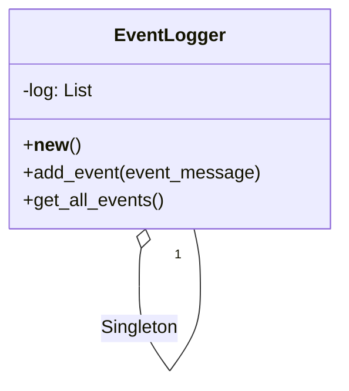

## Львівський Національний Університет Природокористування
## Кафедра Інформаційних систем та Технологій

### Звіт про виконання лабораторної роботи №11
# "Твірні шаблони проектування"

| Виконав: студент групи ІТ-31 Тупісь Роман |
|----------------------------------------------------|
| Перевірив: Татомир Андрій Володимирович            |

**Мета: познайомитися з групою твірних шаблонів проєктування.**

Завдання

1. Дати теоретичний опис твірної групи шаблонів.
2. Відповідно до индивідуального завдання:
- дати теоретичний опис даного шаблону;
- навести приклад коду який реалізовує даний шаблон;
- скласти його UML-діяграму.

Запитання для самоконтролю
1. Що таке твірні шаблони?
2. Які твірні шаблони Вам відомі?
3. Поясніть як реалізовано шаблон у Вашому прикладі.

Відповіді
1.Твірна група шаблонів - ці шаблони відповідають за процес створення об'єктів і спрощують їх ініціалізацію. Вони абстрагують спосіб інстанціювання об'єктів, що забезпечує незалежність коду від конкретних класів.

2.Prototype – це шаблон проектування, що належить до групи породжувальних шаблонів (Creational Patterns). Він дозволяє створювати нові об'єкти на основі вже існуючих, використовуючи механізм копіювання. Прототип використовується, коли процес створення об'єкта "з нуля" є складним або дорогим, а просте копіювання наявного об'єкта дає можливість швидше створювати нові екземпляри.

Шаблон Prototype дозволяє створювати об'єкти, не вказуючи їх класів, а лише копіюючи вже існуючий об'єкт (прототип). Це зменшує залежність від конкретних класів та спрощує створення об'єктів, особливо коли мова йде про складні або ресурсомісткі об'єкти.

Відповіді на питання для самоконтролю.
1. Що таке твірні шаблони?
Твірні шаблони (creational design patterns) відповідають за створення об’єктів. Вони абстрагують процес створення об'єкта, що дозволяє системі бути незалежною від способу створення, композиції та представлення об'єктів. Це може включати управління об’єктами, які потребують складної конфігурації, або надання доступу до об'єктів без прямого їх створення.

2. Які твірні шаблони Вам відомі?
Singleton, Factory Method, Abstract Factory ,Builder ,Prototype

## Висновки. 
На даній лабораторній роботі ми ознайомились з групою твірних шаблонів проектування. 

