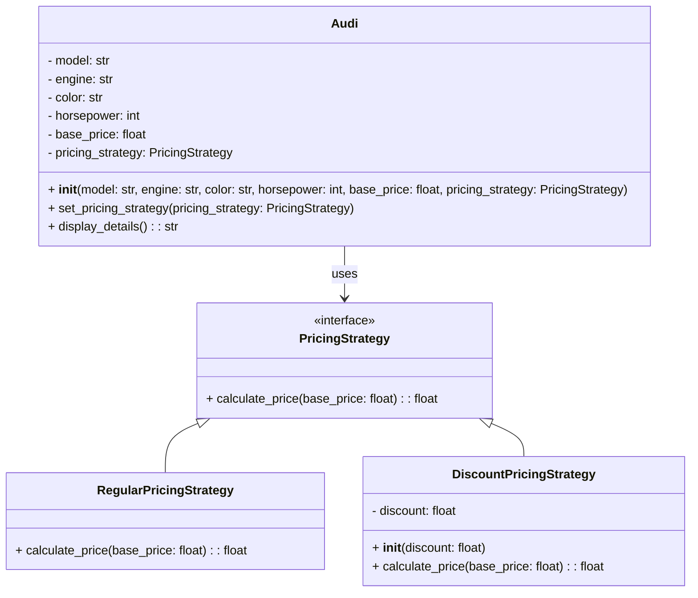

## Львівський Національний Університет Природокористування
## Кафедра Інформаційних систем та Технологій

### Звіт про виконання лабораторної роботи №13
# "Поведінкові шаблони проектування"

| Виконав: студент групи ІТ-31  Тупісь Роман |
|----------------------------------------------------|
| Перевірив: Татомир Андрій Володимирович            |

**Мета: познайомитися з групою поведінкових шаблонів проєктування.**

Завдання

1. Дати теоретичний опис поведінкової групи шаблонів.
2. Відповідно до индивідуального завдання:
- дати теоретичний опис даного шаблону;
- навести приклад коду який реалізовує даний шаблон;
- скласти його UML-діяграму.

Запитання для самоконтролю
1. Що таке поведінкові шаблони?
2. Які поведінкові шаблони Вам відомі?
3. Поясніть як реалізовано шаблон у Вашому прикладі.

Відповіді
1.Поведінкові шаблони проектування зосереджені на алгоритмах і розподілі відповідальності між об'єктами. Вони описують, як об'єкти взаємодіють і як їх поведінка може змінюватися в залежності від конкретних умов. Метою поведінкових шаблонів є спростити комунікацію між об'єктами, зменшуючи зв'язність і підвищуючи гнучкість системи.

2.Strategy" (Стратегія) Він визначає сімейство алгоритмів, інкапсулює їх і робить їх взаємозамінними. Це дозволяє клієнту вибирати алгоритм під час виконання програми. Шаблон "Strategy" дозволяє змінювати алгоритми незалежно від клієнтів, які їх використовують.

Відповіді на питання для самоконтролю.
1. Що таке поведінкові шаблони?
Поведінкові шаблони — це шаблони, які визначають, як об'єкти взаємодіють один з одним. Вони допомагають розподілити відповідальність між об'єктами, зменшуючи зв'язність і покращуючи повторне використання коду. Це може включати управління складними процесами, такими як обробка подій, виконання алгоритмів, обробка станів, реалізація команд або управління змінами.

2. Які поведінкові шаблони Вам відомі?
Chain of Responsibility, Command,Iterator, Mediator, Memento, Observer, Strategy.

3.Компоненти реалізації:
Інтерфейс стратегії PricingStrategy:абстрактний клас, який визначає метод calculate_price(). 
RegularPricingStrategy: реалізує стандартну цінову стратегію.
DiscountPricingStrategy: реалізує цінову стратегію зі знижкою, а метод calculate_price() розраховує ціну з урахуванням знижки.
Клас Audi:представляє автомобіль, включає базову ціну та стратегію ціноутворення. 
Метод set_pricing_strategy() дозволяє змінювати стратегію ціноутворення в будь-який момент.
Метод display_details() викликає метод calculate_price() відповідної стратегії для отримання кінцевої ціни автомобіля.

## Висновки. 
На даній лабораторній роботі ми ознайомились з групою поведінкових шаблонів проектування. 