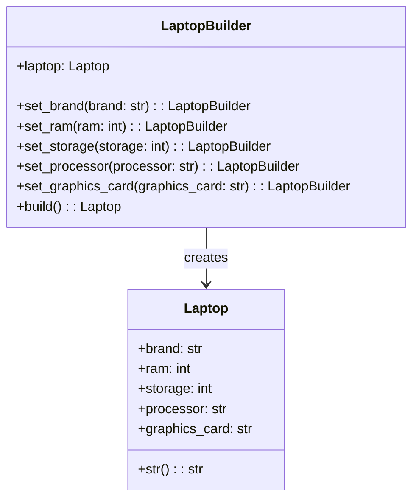

## Львівський Національний Університет Природокористування
## Кафедра Інформаційних систем та Технологій

### Звіт про виконання лабораторної роботи №11
# "Твірні шаблони проектування"

| Виконав: студент групи ІТ-31 Швець Ігор     |
|----------------------------------------------|
| Перевірив: Татомир Андрій Володимирович      |

**Мета: познайомитися з групою твірних шаблонів проєктування.**

Завдання

1. Дати теоретичний опис твірної групи шаблонів.
2. Відповідно до индивідуального завдання:
- дати теоретичний опис даного шаблону;
- навести приклад коду який реалізовує даний шаблон;
- скласти його UML-діяграму.

    Відповіді:
 1)Твірна група шаблонів, також відома як шаблонна група або група породжуючих елементів шаблонів, є важливою концепцією в області теорії шаблонів у комп'ютерних науках та програмуванні. Теоретичний опис цієї групи включає вивчення, як шаблони структурно організовуються і як їх можна комбінувати для досягнення складніших систем або алгоритмів.

 Основні елементи теорії шаблонів:
Шаблон як абстракція: Шаблон — це повторюваний структурний або поведінковий елемент, який вирішує певну задачу або описує рішення певної проблеми в заданому контексті.
 Твірна група: Твірна група шаблонів складається з множини базових шаблонів, які породжують інші шаблони або рішення шляхом комбінування. Це схоже на породжуючі елементи в математичних групах, де група породжується з базових елементів за допомогою комбінацій операцій.
    
    Компоненти твірної групи шаблонів:
 Породжуючі елементи: Це базові шаблони, які можна комбінувати для отримання нових шаблонів. Наприклад, у розробці програмного забезпечення породжуючими елементами можуть бути архітектурні або структурні шаблони.
 Операції комбінування: Це способи, якими шаблони комбінуються для досягнення більш складних конструкцій. До таких операцій можуть належати композиція, наслідування, делегування, що дозволяють будувати нові шаблони з існуючих.
 Простір шаблонів: Це множина всіх можливих шаблонів, які можна утворити з комбінації базових шаблонів. Простір є кінцевим або нескінченним в залежності від правил комбінування та обмежень.

 2)Builder — це породжувальний патерн проєктування, який дозволяє створювати складні об'єкти поетапно. Він дає змогу використовувати один і той самий алгоритм будівництва для створення різних варіантів об'єктів. Завдяки цьому шаблону можна поетапно конструювати складні об'єкти з різними конфігураціями.

    Опис:
 - Один будівельник збирає ігровий ноутбук ( Хороші,нові компоненти)
 - Інший будівельник збирає офісний ноутбук (прості компоненти)
Builder допомагає контролювати, які компоненти додаються до ноутбука, і дозволяє без зусиль змінювати конфігурацію без необхідності змінювати сам код, що відповідає за створення ноутбука.

    UML-ДІАГРАМА

Запитання для самоконтролю
1. Що таке твірні шаблони?
2. Які твірні шаблони Вам відомі?
3. Поясніть як реалізовано шаблон у Вашому прикладі.

Відповіді

1)Твірні шаблони проектування абстрагують процес створення об'єктів.

2)Твірні шаблони проектування: singleton, factory method,
builder, prototype,abstract factory.

3)У прикладі паттерн Builder застосовується для створення різних конфігурацій комп'ютерів. Клас Computer є продуктом, а ComputerBuilder — абстрактний клас, що визначає етапи його створення (вибір процесора, відеокарти, оперативної пам'яті). GamingComputerBuilder та OfficeComputerBuilder — конкретні будівельники, які реалізують специфічні кроки для ігрових та офісних комп'ютерів. Клас Director координує процес, викликаючи методи будівельника у потрібному порядку, що дозволяє легко змінювати конфігурації без зміни коду продукту.

## Висновки. 

У цій лабораторній роботі я ознайомився з групою твірних шаблонів проектування.

