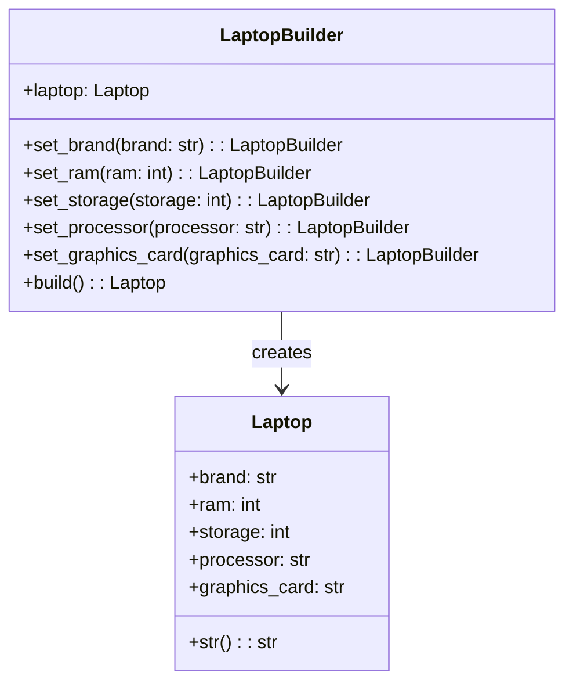

## Львівський Національний Університет Природокористування
## Кафедра Інформаційних систем та Технологій

### Звіт про виконання лабораторної роботи №11
# "Твірні шаблони проектування"

| Виконав: студент групи ІТ-31 Швець Ігор     |
|----------------------------------------------|
| Перевірив: Татомир А. В.                     |

**Мета: познайомитися з групою твірних шаблонів проєктування.**

Завдання

1. Дати теоретичний опис твірної групи шаблонів.
2. Відповідно до индивідуального завдання:
- дати теоретичний опис даного шаблону;
- навести приклад коду який реалізовує даний шаблон;
- скласти його UML-діяграму.

**Опис твірної групи шаблонів**

 Твірна група шаблонів, також відома як шаблонна група або група породжуючих елементів шаблонів, 
 є важливою концепцією в області теорії шаблонів у комп'ютерних науках та програмуванні. 
 Теоретичний опис цієї групи включає вивчення, як шаблони структурно організовуються і як їх можна комбінувати для досягнення складніших систем або алгоритмів.
 Основні елементи теорії шаблонів:
Шаблон як абстракція: Шаблон — це повторюваний структурний або поведінковий елемент, який вирішує певну задачу або описує рішення певної проблеми в заданому контексті.
 Твірна група: Твірна група шаблонів складається з множини базових шаблонів, які породжують інші шаблони або рішення шляхом комбінування. 
 Це схоже на породжуючі елементи в математичних групах, де група породжується з базових елементів за допомогою комбінацій операцій. 
    Компоненти твірної групи шаблонів:
 Породжуючі елементи: Це базові шаблони, які можна комбінувати для отримання нових шаблонів. Наприклад, у розробці програмного забезпечення породжуючими елементами можуть бути архітектурні або структурні шаблони.
 Операції комбінування: Це способи, якими шаблони комбінуються для досягнення більш складних конструкцій. 
 До таких операцій можуть належати композиція, наслідування, делегування, що дозволяють будувати нові шаблони з існуючих.
 Простір шаблонів: Це множина всіх можливих шаблонів, які можна утворити з комбінації базових шаблонів. 
 Простір є кінцевим або нескінченним в залежності від правил комбінування та обмежень.

 **Builder** — це породжувальний патерн проєктування, який дозволяє створювати складні об'єкти поетапно. Він дає змогу використовувати один і той самий алгоритм будівництва для створення різних варіантів об'єктів. Завдяки цьому шаблону можна поетапно конструювати складні об'єкти з різними конфігураціями.

   **Опис коду**

 Код реалізує патерн **Builder** для створення ноутбуків різних типів. Основним класом є Laptop, який представляє ноутбук з кількома характеристиками: брендом, обсягом оперативної пам'яті, обсягом пам'яті для зберігання, типом процесора та графічної карти.

Клас **Laptop** має метод для виведення інформації про ноутбук у зручному форматі, що дозволяє користувачеві легко оцінити характеристики пристрою.
Клас **LaptopBuilder** визначає методи для налаштування компонентів ноутбука: set_brand, set_ram, set_storage, set_processor та set_graphics_card. Ці методи дозволяють поетапно встановлювати параметри ноутбука, створюючи необхідну конфігурацію.

Наприклад, за допомогою **LaptopBuilder** можна налаштувати ігровий ноутбук з високими характеристиками, включаючи потужний процесор і графічну карту, або офісний ноутбук з простішими компонентами для щоденної роботи.
Завершальним кроком є метод **build**, який створює об'єкт класу Laptop з усіма налаштованими параметрами, готовий до використання.
Таким чином, патерн Builder дозволяє легко та гнучко створювати ноутбуки з різними характеристиками, спрощуючи процес налаштування.

Рисунок UML діаграми на основі [коду.](./Code.py)

## Висновки. 
На цій лабораторній роботі я познайомився з групою шаблонів проектування, зокрема з шаблоном Builder. Виконуючи завдання, я навчився відокремлювати процес створення об'єктів від їхньої реалізації, що дозволяє створювати різні конфігурації об'єктів без зміни базового коду. Це забезпечує гнучкість у розробці складних систем, де об'єкти можуть бути створені поетапно відповідно до специфічних вимог.

Я також отримав практичні навички у створенні UML-діаграм, які наочно ілюструють структуру та взаємодію об'єктів у системі. Це знання сприяло кращому розумінню архітектури програм і полегшило процес документування коду.
