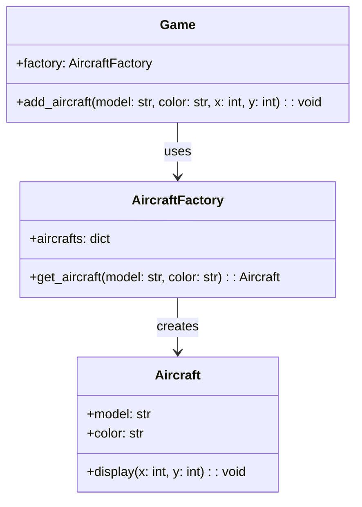

## Львівський Національний Університет Природокористування
## Кафедра Інформаційних систем та Технологій

### Звіт про виконання лабораторної роботи №12
# "Структурні шаблони проектування"

| Виконав: студент групи ІТ-31 Швець Ігор      |
|----------------------------------------------|
| Перевірив: Татомир А. В.                     |

**Мета: познайомитися з групою структурних шаблонів проєктування.**

Завдання

1. Дати теоретичний опис структурної групи шаблонів.
2. Відповідно до индивідуального завдання:
- дати теоретичний опис даного шаблону;
- навести приклад коду який реалізовує даний шаблон;
- скласти його UML-діяграму.

**Опис структурної групи шаблонів.**

Структурні шаблони проектування — це набір патернів, які описують способи організації відносин між класами та об'єктами.
Вони сприяють інтеграції елементів системи в єдину структуру, спрощують код і підвищують його гнучкість. 
Основна мета цих шаблонів полягає в полегшенні роботи з класами та об'єктами, а також у створенні більш зрозумілої, легкої для розширення та підтримки системи.
Патерн Flyweight належить до групи структурних шаблонів проектування і призначений для зменшення використання пам'яті, коли потрібно створити велику кількість об'єктів з подібними властивостями. 
Цей патерн дозволяє економити ресурси, зберігаючи спільні дані в одному місці, а не створюючи новий об'єкт для кожної інстанса.

**Опис коду**

Клас **Aircraft** представляє літак, який має два атрибути: model (модель) та color (колір). Він також має метод display, що дозволяє відображати літак на екрані за заданими координатами (x, y).

Клас **AircraftFactory** є фабрикою, що відповідає за створення об'єктів класу Aircraft. Він має атрибут aircrafts, який, імовірно, використовується для зберігання вже створених літаків, а також метод get_aircraft, який приймає модель та колір літака, повертаючи відповідний об'єкт. Цей підхід дозволяє уникати повторного створення літаків з однаковими характеристиками.

Клас Game використовує **AircraftFactory** для додавання літаків у гру. Він має метод **add_aircraft**, який приймає модель, колір, а також координати (x, y) для розміщення літака. Цей метод викликає фабрику, щоб отримати новий літак і розмістити його у грі.

Таким чином, ця структура реалізує патерн проектування **Фабрика**, що забезпечує гнучкість і простоту у створенні об'єктів літаків, розділяючи логіку створення від бізнес-логіки гри.

Рисунок UML діаграми на основі [коду.](./Code.py)

## Висновки. 

У цій лабораторній роботі я ознайомився з категорією структурних шаблонів проектування, зокрема з патерном Flyweight, який дозволяє ефективно управляти ресурсами, зменшуючи кількість об'єктів, що створюються, шляхом повторного використання спільних даних. Я також розглянув патерн Фабрика, який спрощує процес створення об'єктів та забезпечує гнучкість у побудові систем.

Під час виконання завдання я навчився застосовувати патерни для вирішення проблем економії пам'яті та спрощення логіки створення об'єктів у грі. Описаний код і UML-діаграма чітко демонструють, як можна використовувати фабрику для централізованого управління створенням літаків і їх відображення у грі. Завдяки цьому підходу, система стає більш зрозумілою та легкою для розширення.

Окрім цього, я поглибив свої знання в проектуванні архітектур програмного забезпечення, використовуючи інструменти, такі як UML-діаграми, для візуалізації структури взаємодії об'єктів. Це допомогло краще зрозуміти організацію системи та полегшило документування коду.