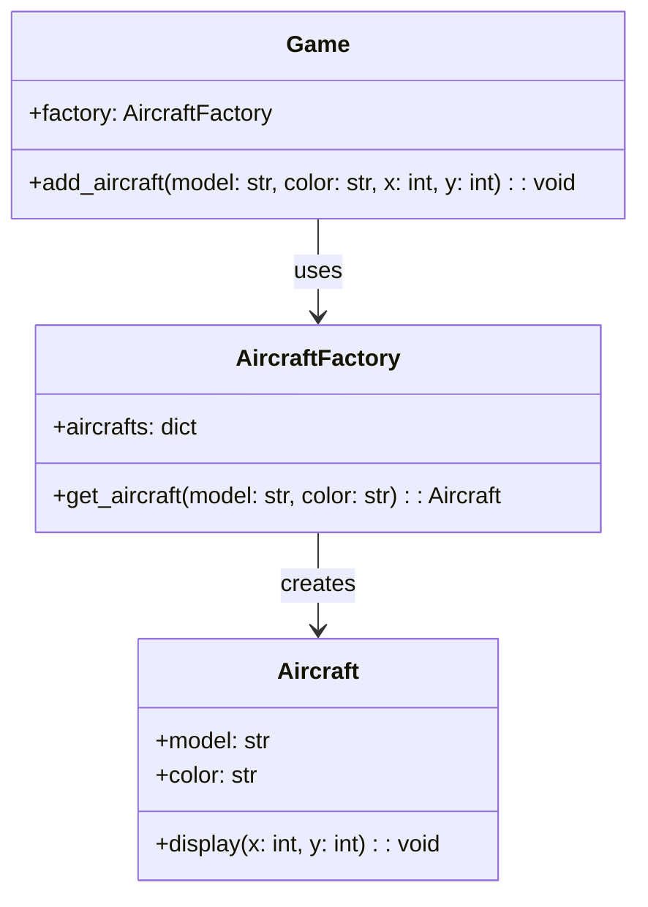

## Львівський Національний Університет Природокористування
## Кафедра Інформаційних систем та Технологій

### Звіт про виконання лабораторної роботи №12
# "Структурні шаблони проектування"

| Виконав: студент групи ІТ-31 Швець Ігор      |
|----------------------------------------------|
| Перевірив: Татомир Андрій Володимирович      |

**Мета: познайомитися з групою структурних шаблонів проєктування.**

Завдання

1. Дати теоретичний опис структурної групи шаблонів.
2. Відповідно до индивідуального завдання:
- дати теоретичний опис даного шаблону;
- навести приклад коду який реалізовує даний шаблон;
- скласти його UML-діяграму.

Відповіді:

1) Структурні шаблони проектування — це набір патернів, які описують способи організації відносин між класами та об'єктами. Вони сприяють інтеграції елементів системи в єдину структуру, спрощують код і підвищують його гнучкість. Основна мета цих шаблонів полягає в полегшенні роботи з класами та об'єктами, а також у створенні більш зрозумілої, легкої для розширення та підтримки системи.

2)Патерн Flyweight належить до групи структурних шаблонів проектування і призначений для зменшення використання пам'яті, коли потрібно створити велику кількість об'єктів з подібними властивостями. Цей патерн дозволяє економити ресурси, зберігаючи спільні дані в одному місці, а не створюючи новий об'єкт для кожної інстанса.

UML-ДІАГРАМА

Запитання для самоконтролю
1. Що таке структурні шаблони?
2. Які структурні шаблони Вам відомі?
3. Поясніть як реалізовано шаблон у Вашому прикладі.

Відповіді

1)Структурні шаблони проектування — це патерни, які допомагають впорядкувати класи та об'єкти в структури, що полегшують їх використання.

2)Adapter (Адаптер): Дозволяє об'єктам з несумісними інтерфейсами працювати разом, перетворюючи інтерфейс одного класу в інтерфейс, очікуваний іншим класом.

Bridge (Міст): Розділяє абстракцію та реалізацію так, щоб вони могли змінюватися незалежно. Це дозволяє легко додавати нові реалізації без зміни коду абстракції.

Composite (Композит): Дозволяє об'єктам створювати дерева об'єктів, які можуть бути оброблені як єдине ціле. Це корисно для представлення ієрархій об'єктів.

Decorator (Декоратор): Дозволяє динамічно додавати нові функції до об'єктів, обертаючи їх у спеціальні класи без зміни їх структури.

Facade (Фасад): Надає спрощений інтерфейс до складної системи класів, що робить систему легшою для використання.

Flyweight : Зменшує використання пам'яті, дозволяючи зберігати спільні частини об'єктів у єдиному місці, а унікальні частини передавати методам.

Proxy (Проксі): Дозволяє контролювати доступ до об'єктів, створюючи заміщувальний об'єкт, який управляє доступом до оригінального об'єкта.

3)Клас Aircraft (Літак):

Це конкретний Flyweight-клас, який представляє літак з характеристиками, такими як модель і колір.
Метод display(x, y) відповідає за відображення літака на екрані, використовуючи параметри позиції x та y. Це означає, що клас зберігає спільні дані, а унікальні (позиції) передаються як аргументи методу.
Клас AircraftFactory (Фабрика літаків):

Це клас-фабрика, що управляє створенням і зберіганням об'єктів Aircraft.
У методі get_aircraft(model, color) реалізується логіка перевірки, чи існує вже літак з вказаними характеристиками. Якщо так, повертається існуючий літак. Якщо ні, створюється новий об'єкт Aircraft, який потім зберігається в словнику aircrafts.
Ця логіка дозволяє зменшити використання пам'яті, оскільки одна інстанція літака може бути використана для кількох запитів.
Клас Game (Гра):

У класі Game реалізовано метод add_aircraft(model, color, x, y), який використовує фабрику для отримання літаків.
Клас взаємодіє з фабрикою, запитуючи літаки, і передає їх для відображення з конкретними позиціями.
Це демонструє, як клієнтський код (гра) може використовувати Flyweight-об'єкти без необхідності знати про деталі їх створення.
## Висновки. 

У цій лабораторній роботі я ознайомився з категорією структурних шаблонів проектування.