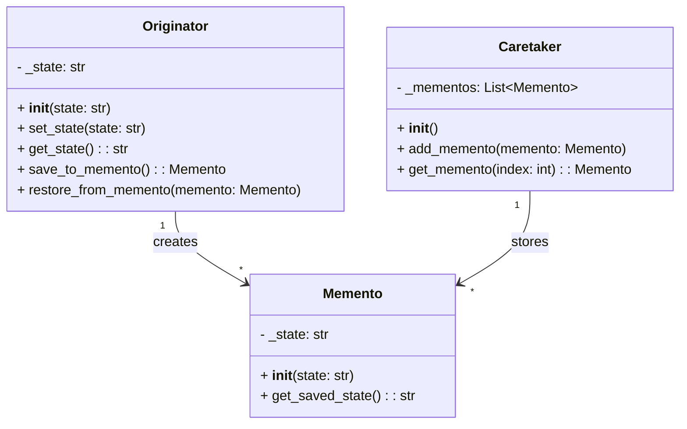

## Львівський Національний Університет Природокористування
## Кафедра Інформаційних систем та Технологій

### Звіт про виконання лабораторної роботи №13
# "Поведінкові шаблони проектування"

| Виконав: студент групи ІТ-31 Швець Ігор      |
|----------------------------------------------|
| Перевірив: Татомир А. В.                     |

**Мета: познайомитися з групою поведінкових шаблонів проєктування.**

Завдання

1. Дати теоретичний опис поведінкової групи шаблонів.
2. Відповідно до индивідуального завдання:
- дати теоретичний опис даного шаблону;
- навести приклад коду який реалізовує даний шаблон;
- скласти його UML-діяграму.

**Опис поведінкової групи шаблонів**

Поведінкові шаблони проектування — це група патернів, які описують способи взаємодії між об'єктами та класами у системі. 
Їх основна мета полягає в ефективній організації комунікації між об'єктами, спрощенні алгоритмів і динамічному розподілі обов'язків між ними. 
Ці шаблони допомагають визначити, як об'єкти обмінюються інформацією та як координація між ними може бути реалізована, зберігаючи систему гнучкою і легкою для підтримки.

**Опис коду**

 Клас **Originator** представляє об'єкт, стан якого можна зберігати і відновлювати за допомогою шаблону Memento. 
 Він містить атрибут _state, що зберігає поточний стан об'єкта. 
 Клас має методи для зміни стану (set_state), отримання поточного стану (get_state), створення "знімку" стану за допомогою методу save_to_memento, 
 а також для відновлення стану з об'єкта Memento через метод restore_from_memento.

**Memento** – це клас, що інкапсулює стан об'єкта Originator. Він зберігає стан в атрибуті _state і надає доступ до нього через метод get_saved_state, дозволяючи відновити цей стан у майбутньому.

Клас **Caretaker** відповідає за збереження та управління об'єктами Memento. Він зберігає знімки станів у списку _mementos і дозволяє додавати нові стани через метод add_memento або отримувати їх за індексом за допомогою методу get_memento.

Клас **Originator** створює об'єкти Memento, коли потрібно зберегти свій поточний стан, і використовує їх для відновлення стану. Caretaker забезпечує збереження цих знімків, щоб дозволити їх відновлення в майбутньому.

Рисунок UML діаграми на основі [коду.](./code.py)

## Висновки. 

У цій роботі я ознайомився з поведінковими шаблонами проектування, зокрема з шаблоном Memento. 
Цей шаблон дозволяє зберігати та відновлювати стан об'єкта без порушення інкапсуляції, що особливо корисно в системах, 
де потрібно реалізувати функціонал скасування змін або збереження проміжних станів.

Під час виконання роботи я навчився розділяти збереження стану об'єкта (в класі Memento) від логіки його відновлення (в класі Originator) та управління збереженими станами (в класі Caretaker). 
Це забезпечує гнучкість у розробці системи та полегшує її підтримку.

Також я створив UML-діаграму для наочного представлення взаємодії між класами у даній реалізації. 
Це допомогло краще зрозуміти архітектуру та принципи функціонування шаблону Memento.

