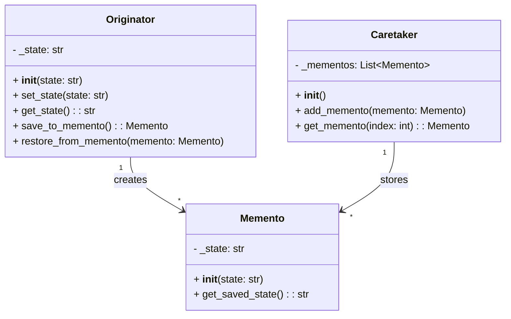

## Львівський Національний Університет Природокористування
## Кафедра Інформаційних систем та Технологій

### Звіт про виконання лабораторної роботи №13
# "Поведінкові шаблони проектування"

| Виконав: студент групи ІТ-31 Швець Ігор      |
|----------------------------------------------|
| Перевірив: Татомир Андрій Володимирович      |

**Мета: познайомитися з групою поведінкових шаблонів проєктування.**

Завдання

1. Дати теоретичний опис поведінкової групи шаблонів.
2. Відповідно до индивідуального завдання:
- дати теоретичний опис даного шаблону;
- навести приклад коду який реалізовує даний шаблон;
- скласти його UML-діяграму.

1) Поведінкові шаблони проектування представляють собою набір рішень, спрямованих на організацію взаємодії між об'єктами в системі. 
Вони допомагають вирішувати завдання, пов'язані з комунікацією між об'єктами, управлінням станом програми та поведінкою об'єктів, що сприяє підвищенню гнучкості та зручності
 розширення коду.

2)Шаблон проектування Memento (Спогад) використовується для збереження і відновлення попереднього стану об'єкта без порушення принципу інкапсуляції.
 Цей шаблон дозволяє об'єкту зберігати свій стан у спеціальному об'єкті "спогаді" (memento), а в разі потреби – повертати його до попереднього стану.

Основні учасники шаблону Memento:

Originator (Творець) – об'єкт, стан якого потрібно зберегти. Він створює та використовує об'єкт-спогад для збереження або відновлення свого стану.
Memento (Спогад) – об'єкт, що зберігає знімок внутрішнього стану Originator. Він є закритим для інших об'єктів, що дозволяє зберегти інкапсуляцію.
Caretaker (Опікун) – керує збереженням і відновленням стану об'єкта, зберігаючи об'єкти-спогади. Однак він не має доступу до внутрішнього стану цих спогадів.

UML-ДІАГРАМА

Запитання для самоконтролю
1. Що таке поведінкові шаблони?
2. Які поведінкові шаблони Вам відомі?
3. Поясніть як реалізовано шаблон у Вашому прикладі.

Відповіді:

1)Поведінкові шаблони проектування – це категорія шаблонів, які визначають способи взаємодії та комунікації між об'єктами у програмі. Їхня основна мета – спростити 
керування потоками та поведінкою об'єктів, роблячи систему більш гнучкою та масштабованою.

Основні завдання поведінкових шаблонів:

Взаємодія між об'єктами: Поведінкові шаблони допомагають організувати ефективну та гнучку комунікацію між об'єктами, яка дозволяє легко змінювати їхню взаємодію.
Розподіл відповідальності: Вони спрямовані на чітке розмежування ролей та відповідальності між об'єктами, що спрощує підтримку та розширення коду.
Зменшення зв'язності: Шаблони зменшують залежність об'єктів один від одного, що дозволяє легше змінювати систему.

2)Chain of Responsibility (Ланцюжок відповідальностей)
– Дозволяє передавати запит через ланцюжок обробників, доки один із них не обробить запит.

Command (Команда)
– Інкапсулює запит як об'єкт, дозволяючи параметризувати клієнтів різними запитами, чергувати або логувати запити, а також підтримувати скасування операцій.

Interpreter (Інтерпретатор)
– Визначає граматику і спосіб її інтерпретації для певної мови або виразів. Корисний для створення мов або обробки текстових форматів.

Iterator (Ітератор)
– Забезпечує спосіб послідовного доступу до елементів колекції без розкриття її внутрішньої реалізації.

Mediator (Посередник)
– Визначає об'єкт, який керує взаємодією між іншими об'єктами, знижуючи їхню залежність один від одного.

Memento (Спогад)
– Зберігає і відновлює попередній стан об'єкта без порушення інкапсуляції.

Observer (Спостерігач)
– Встановлює залежність "один до багатьох" між об'єктами, коли при зміні стану одного об'єкта інші отримують повідомлення та автоматично оновлюються.

State (Стан)
– Дозволяє об'єкту змінювати свою поведінку в залежності від свого внутрішнього стану. Це виглядає так, ніби об'єкт змінив свій клас.

Strategy (Стратегія)
– Дозволяє визначити сімейство алгоритмів, інкапсулювати їх і робити взаємозамінними залежно від контексту.

Template Method (Шаблонний метод)
– Визначає загальну структуру алгоритму в методі, дозволяючи підкласам перевизначати окремі кроки алгоритму, не змінюючи його структуру.

Visitor (Відвідувач)
– Дозволяє додавати нові операції до класів, не змінюючи їхньої структури. Використовується, коли потрібно виконати певну операцію над різними об'єктами.

Null Object (Нульовий об'єкт)
– Шаблон, який використовує об'єкт, що не виконує жодних дій, замість перевірок на null.

3)У прикладі реалізовано шаблон Memento (Спогад), який дозволяє зберігати та відновлювати попередній стан об'єкта без порушення інкапсуляції. 
Цей шаблон корисний, коли потрібно реалізувати функціональність "скасування" (undo) або зберігати історію змін стану об'єкта.

## Висновки. 

Під час цієї лабораторної роботи я ознайомився з групою поведінкових шаблонів проектування.

