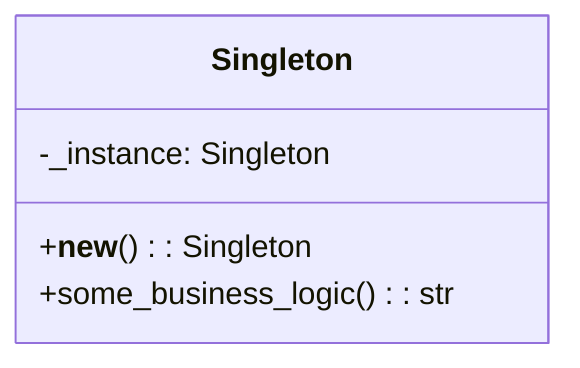

## Львівський Національний Університет Природокористування
## Кафедра Інформаційних систем та Технологій

### Звіт про виконання лабораторної роботи №11
# "Твірні шаблони проектування"

| Виконав: студент групи ІТ-31 Смолинець Максим |
|-----------------------------------------------|
| Перевірив: Татомир Андрій Володимирович       | 

**Мета: познайомитися з групою твірних шаблонів проєктування.**

Завдання 
1. Дати теоретичний опис твірної групи шаблонів.
2. Відповідно до индивідуального завдання:
- дати теоретичний опис даного шаблону;
- навести приклад коду який реалізовує даний шаблон;
- скласти його UML-діяграму.
- 
1. Твірні шаблони проектування спрямовані на організацію та 
структурування класів і об'єктів у системі. Вони дозволяють 
ефективно взаємодіяти між різними елементами програми, 
спрощуючи зв'язки між ними та покращуючи читабельність коду.
Ці шаблони допомагають створити ієрархію, в якій об'єкти 
можуть бути об'єднані в структури, що дозволяють працювати 
з групами об'єктів так само, як з окремими. Твірні шаблони 
забезпечують гнучкість у розширенні та зміні системи, зберігаючи 
при цьому її простоту та зрозумілість.

2. Одиничний (Singleton) — це твірний патерн проектування, який 
забезпечує наявність тільки одного екземпляра класу та надає 
глобальну точку доступу до нього. Цей шаблон гарантує, що клас 
має лише один екземпляр, і забезпечує до нього доступ через 
статичний метод.

Опис:

 - Клас Singleton контролює створення свого єдиного екземпляра.
 - Метод __new__ перевіряє, чи вже існує екземпляр; якщо ні, то створює його.
 - Метод some_business_logic реалізує бізнес-логіку, пов'язану з екземпляром.

UML-ДІАГРАМА

 
Запитання для самоконтролю
1. Що таке твірні шаблони?
2. Які твірні шаблони Вам відомі?
3. Поясніть як реалізовано шаблон у Вашому прикладі.

Відповіді

1) Твірні шаблони проектування — це шаблони проектування, що абстрагують процес побудови об'єктів.

2) Твірні шаблони проектування: Factory Method, Abstract Factory, Singleton, Builder, Prototype.

3) У коді реалізовано шаблон Singleton:
 - Клас Singleton забезпечує єдиний екземпляр через перевірку в методі __new__.
 - Виклик Singleton() завжди повертає один і той же об'єкт.
 - Метод some_business_logic надає можливість виконувати бізнес-логіку з цим єдиним екземпляром.

## Висновки. 

На даній лабораторній роботі я познайомився з групою твірних шаблонів проектування. 