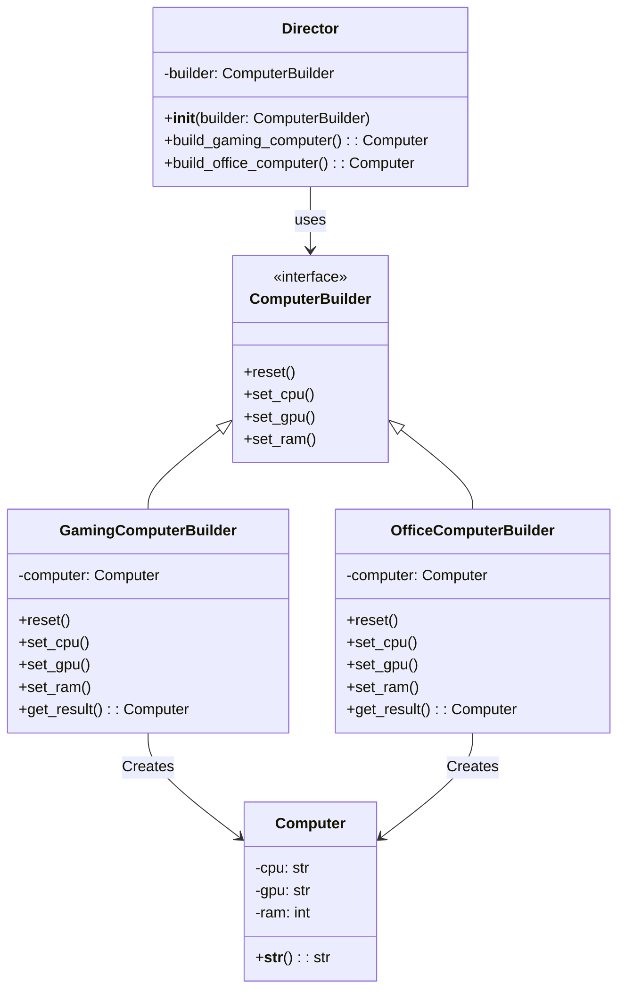

## Львівський Національний Університет Природокористування
## Кафедра Інформаційних систем та Технологій

### Звіт про виконання лабораторної роботи №12
# "Твірні шаблони проектування"

| Виконав: студент групи ІТ-31 Смолинець Максим |
|-----------------------------------------------|
| Перевірив: Татомир Андрій Володимирович       | 

**Мета: познайомитися з групою твірних шаблонів проєктування.**

Завдання 

1. Дати теоретичний опис твірної групи шаблонів.
2. Відповідно до индивідуального завдання:
- дати теоретичний опис даного шаблону;
- навести приклад коду який реалізовує даний шаблон;
- скласти його UML-діяграму.

Твірні шаблони проектування включають шаблони, що відповідають за 
створення об'єктів у програмному забезпеченні. Вони ізолюють процес 
створення об'єктів від решти коду, що дозволяє зробити систему більш 
гнучкою та легко розширюваною. Твірні шаблони пропонують механізми для 
контролю створення об'єктів і надають гнучкість у виборі механізму 
інстанціювання класів, що робить систему легше масштабованою та змінюваною.

Компонувальник (Composite) — це структурний патерн проектування, який 
дозволяє об'єднувати об'єкти у вигляді деревовидної структури для 
представлення ієрархій "ціле-частина". Компонувальник дозволяє клієнтському 
коду однаково працювати як з окремими об'єктами, так і з групами об'єктів.

Опис:
 - Клас MenuComponent є абстрактним і представляє як страви, так і меню.
 - Клас MenuItem представляє окрему страву, яка має назву і ціну.
 - Клас Menu представляє меню, яке може містити як страви, так і інші підменю. 
 - Меню підтримує додавання і видалення компонентів.
 - За допомогою Composite можна легко створювати ієрархічну структуру меню, де 
 - меню може містити як окремі страви, так і підменю.

UML-ДІАГРАМА

 
Запитання для самоконтролю
1. Що таке твірні шаблони?
2. Які твірні шаблони Вам відомі?
3. Поясніть як реалізовано шаблон у Вашому прикладі.

Відповіді

1)Твірні шаблони проектування - це шаблони проектування,
що абстрагують процес побудови об'єктів.

2)Твірні шаблони проектування: singleton, factory method,
abstract factory, builder, prototype.

3)У цьому прикладі патерн Composite дозволяє об'єднати 
окремі страви та підменю в єдину структуру. Це надає можливість 
однаково працювати як з листами (страва), так і з гілками 
(підменю), використовуючи один і той самий інтерфейс.

## Висновки. 

На даній лабораторній роботі я познайомився з групою твірних шаблонів проектування. 