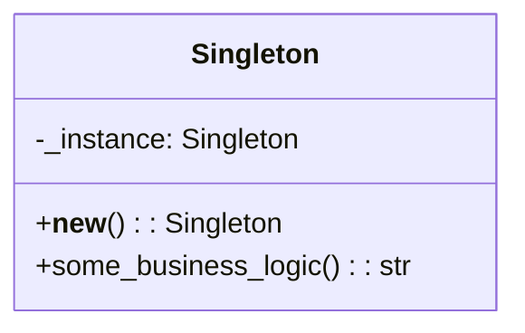

## Львівський Національний Університет Природокористування
## Кафедра Інформаційних систем та Технологій

### Звіт про виконання лабораторної роботи №11
# "Твірні шаблони проектування"

| Виконав: студент групи ІТ-31 Смолинець М. І. |
|----------------------------------------------|
| Перевірив: Татомир А. В.                     | 

**Мета: познайомитися з групою твірних шаблонів проєктування.**

Завдання 
1. Дати теоретичний опис твірної групи шаблонів.
2. Відповідно до индивідуального завдання:
- дати теоретичний опис даного шаблону;
- навести приклад коду який реалізовує даний шаблон;
- скласти його UML-діяграму.

**Опис твірної групи шаблонів**

Твірні шаблони проектування спрямовані на організацію та 
структурування класів і об'єктів у системі. Вони дозволяють 
ефективно взаємодіяти між різними елементами програми, 
спрощуючи зв'язки між ними та покращуючи читабельність коду.
Ці шаблони допомагають створити ієрархію, в якій об'єкти 
можуть бути об'єднані в структури, що дозволяють працювати 
з групами об'єктів так само, як з окремими. Твірні шаблони 
забезпечують гнучкість у розширенні та зміні системи, зберігаючи 
при цьому її простоту та зрозумілість.

Шаблон проектування Singleton — це твірний патерн проектування, який 
забезпечує наявність тільки одного екземпляра класу та надає 
глобальну точку доступу до нього. Цей шаблон гарантує, що клас 
має лише один екземпляр, і забезпечує до нього доступ через 
статичний метод.

**Опис коду**
   
 - Клас **Singleton** контролює  створення свого єдиного екземпляра.
 - Метод `__`new`__` перевіряє, чи вже існує екземпляр; якщо ні, то створює його.
 - Метод some_business_logic реалізує бізнес-логіку, пов'язану з екземпляром.

UML-ДІАГРАМА

 Рисунок UML діаграми на основі [коду.](./singletonn.py)

## Висновки. 

У цій лабораторній роботі я ознайомився з патерном "Одинак" (Singleton), який 
обмежує створення об'єктів класу до одного екземпляра. Під час виконання роботи 
я навчився застосовувати цей шаблон для контролю кількості створюваних об'єктів 
та забезпечення єдиного доступу до них. Патерн "Одинак" дозволяє зберігати стан 
об'єкта і гарантує, що всі звернення до нього будуть здійснюватися через один і 
той самий екземпляр.

Також я здобув досвід роботи з динамічним створенням об'єктів у Python через 
метод `__`new`__`(), що дає змогу контролювати процес ініціалізації класу. Крім того,
я закріпив навички побудови UML-діаграм, що допомогло краще зрозуміти архітектуру 
програми та її взаємодію з іншими компонентами. 