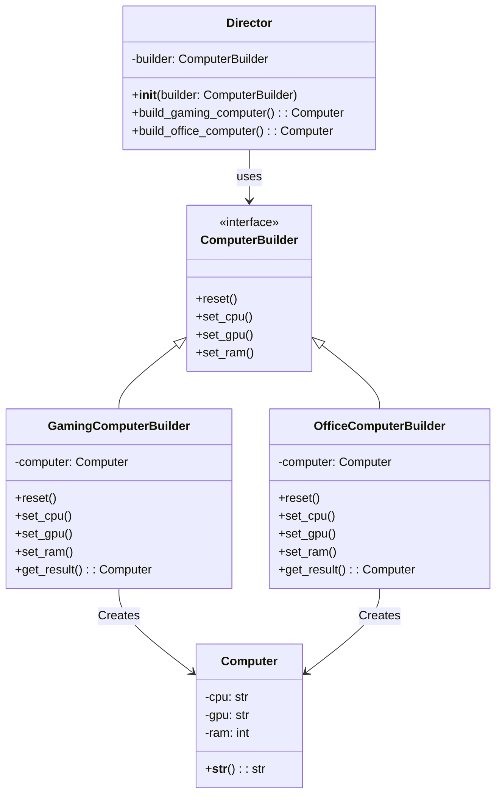

## Львівський Національний Університет Природокористування
## Кафедра Інформаційних систем та Технологій

### Звіт про виконання лабораторної роботи №11
# "Твірні шаблони проектування"

| Виконав: студент групи ІТ-31 Смолинець Максим |
|-----------------------------------------------|
| Перевірив: Татомир Андрій Володимирович       | 

**Мета: познайомитися з групою твірних шаблонів проєктування.**

Завдання 

1. Дати теоретичний опис твірної групи шаблонів.
2. Відповідно до индивідуального завдання:
- дати теоретичний опис даного шаблону;
- навести приклад коду який реалізовує даний шаблон;
- скласти його UML-діяграму.

1. Структурні шаблони проектування спрямовані на 
організацію та структурування класів і об'єктів у 
системі. Вони дозволяють ефективно взаємодіяти між
різними елементами програми, спрощуючи зв'язки між 
ними та покращуючи читабельність коду. Ці шаблони 
допомагають створити ієрархію, в якій об'єкти можуть 
бути об'єднані в структури, що дозволяють працювати з 
групами об'єктів так само, як з окремими. Структурні
шаблони забезпечують гнучкість у розширенні та зміні системи, з
берігаючи при цьому її простоту та зрозумілість.

2. Компонувальник (Composite) — це структурний патерн проектування, який 
дозволяє об'єднувати об'єкти у вигляді деревовидної структури для 
представлення ієрархій "ціле-частина". Компонувальник дозволяє клієнтському 
коду однаково працювати як з окремими об'єктами, так і з групами об'єктів.

Опис:
 - Клас MenuComponent є абстрактним і представляє як страви, так і меню.
 - Клас MenuItem представляє окрему страву, яка має назву і ціну.
 - Клас Menu представляє меню, яке може містити як страви, так і інші підменю. 
 - Меню підтримує додавання і видалення компонентів.
 - За допомогою Composite можна легко створювати ієрархічну структуру меню, де 
 - меню може містити як окремі страви, так і підменю.

UML-ДІАГРАМА

 
Запитання для самоконтролю
1. Що таке структурні шаблони?
2. Які структурні шаблони Вам відомі?
3. Поясніть як реалізовано шаблон у Вашому прикладі.

Відповіді

1)Структурні шаблони проектування - це шаблони проектування,
що абстрагують процес побудови об'єктів.

2)Структурні шаблони проектування: adapter, decorator, 
facade, proxy, composite.

3)У коді реалізовано шаблон Composite:
MenuComponent — абстрактний клас для елементів меню.
MenuItem — представляє окрему страву з методом show.
Menu — представляє меню, може містити інші меню чи страви, 
реалізує методи add, remove, show.
Цей шаблон дозволяє обробляти одиничні страви та цілі меню 
однаково, формуючи ієрархію.

## Висновки. 

На даній лабораторній роботі я познайомився з групою твірних шаблонів проектування. 