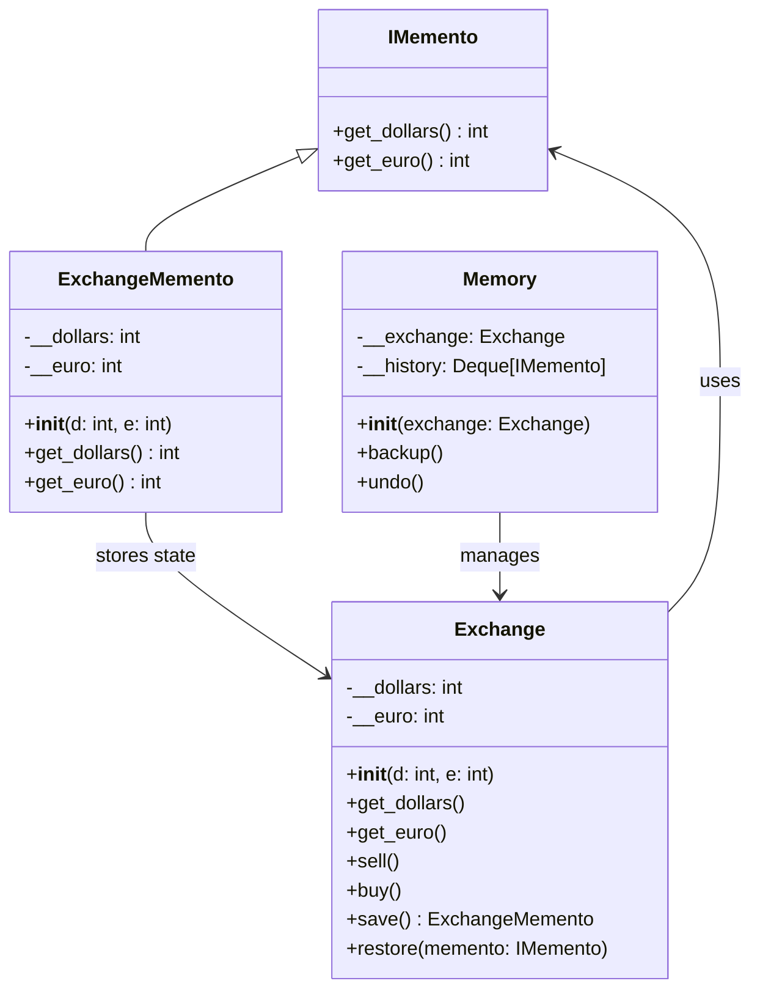

## Львівський Національний Університет Природокористування
## Кафедра Інформаційних систем та Технологій

### Звіт про виконання лабораторної роботи №13
# "Поведінкові шаблони проектування"

| Виконав: студент групи ІТ-31 Смолинець М. І. |
|----------------------------------------------|
| Перевірив: Татомир А. В.                     | 

**Мета: познайомитися з групою поведінкових шаблонів проєктування.**

Завдання 

1. Дати теоретичний опис поведінкової групи шаблонів.
2. Відповідно до индивідуального завдання:
- дати теоретичний опис даного шаблону;
- навести приклад коду який реалізовує даний шаблон;
- скласти його UML-діяграму.

**Опис поведінкової групи шаблонів**

Поведінкові шаблони проектування спрямовані на організацію та 
структурування класів і об'єктів у системі. Вони дозволяють 
ефективно взаємодіяти між різними елементами програми, спрощуючи 
зв'язки між ними та покращуючи читабельність коду. Ці шаблони 
допомагають створити ієрархію, в якій об'єкти можуть бути об'
єднані в структури, що дозволяють працювати з групами об'єктів 
так само, як з окремими. Твірні шаблони забезпечують гнучкість у 
розширенні та зміні системи, зберігаючи при цьому її простоту та 
зрозумілість.

Шаблон проектування Memento — це твірний патерн проектування, який дозволяє 
зберігати і відновлювати попередній стан об'єкта без порушення
інкапсуляції. Цей шаблон забезпечує механізм, який дозволяє 
захоплювати та зберігати стан об'єкта, а потім відновлювати його 
в будь-який момент.

**Опис коду**

 Опис класів:
IMemento:

- **IMemento** це інтерфейс для зберігача стану. Він визначає методи get_dollars і get_euro, 
які дозволяють отримати збережені значення.
ExchangeMemento:

- **ExchangeMemento** конкретна реалізація інтерфейсу IMemento. Він зберігає поточний стан об'єкта 
Exchange, включаючи кількість доларів і євро.
Exchange:

- **Exchange** це об'єкт, який представляє валютний обмін. Він має методи для продажу доларів
(sell), покупки євро (buy), а також для збереження поточного стану через метод 
save() та відновлення через метод restore().
Memory:

- **Memory** клас, який управляє збереженими станами (історією) об'єкта Exchange. Він 
дозволяє створювати "знімки" стану через метод backup() і повертатися до 
попереднього стану за допомогою методу undo().

Рисунок UML діаграми на основі [коду.](./momentomory.py)

## Висновки.

На даній лабораторній роботі я ознайомився з патерном "Зберігач" (Memento), 
який належить до групи поведінкових шаблонів проєктування. Під час виконання
роботи я навчився відокремлювати процес збереження та відновлення станів 
об'єктів від їхньої реалізації, що дозволяє відкотити систему до попереднього
стану без втручання в основний код. Це корисно в ситуаціях, коли потрібен
контроль над станом системи та можливість його відновлення.

Також я здобув досвід у побудові UML-діаграм для візуалізації архітектури 
програми, що допомогло краще зрозуміти взаємодію об'єктів і спростило процес
    документування коду.

Додатково, я закріпив навички роботи з поведінковими патернами, що допомагає 
у розробці гнучких і розширюваних систем.