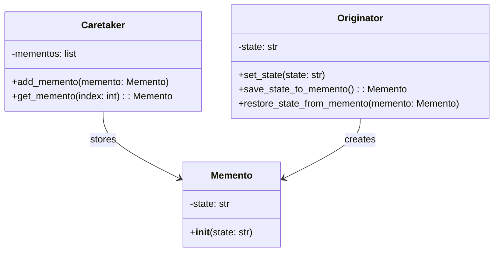

## Львівський Національний Університет Природокористування
## Кафедра Інформаційних систем та Технологій

### Звіт про виконання лабораторної роботи №13
# "Твірні шаблони проектування"

| Виконав: студент групи ІТ-31 Смолинець Максим |
|-----------------------------------------------|
| Перевірив: Татомир Андрій Володимирович       | 

**Мета: познайомитися з групою твірних шаблонів проєктування.**

Завдання 

1. Дати теоретичний опис твірної групи шаблонів.
2. Відповідно до индивідуального завдання:
- дати теоретичний опис даного шаблону;
- навести приклад коду який реалізовує даний шаблон;
- скласти його UML-діяграму.

1. Твірні шаблони проектування спрямовані на організацію та 
структурування класів і об'єктів у системі. Вони дозволяють 
ефективно взаємодіяти між різними елементами програми, спрощуючи 
зв'язки між ними та покращуючи читабельність коду. Ці шаблони 
допомагають створити ієрархію, в якій об'єкти можуть бути об'
єднані в структури, що дозволяють працювати з групами об'єктів 
так само, як з окремими. Твірні шаблони забезпечують гнучкість у 
розширенні та зміні системи, зберігаючи при цьому її простоту та 
зрозумілість.

2. Мементо (Memento) — це твірний патерн проектування, який дозволяє 
зберігати і відновлювати попередній стан об'єкта без порушення
інкапсуляції. Цей шаблон забезпечує механізм, який дозволяє 
захоплювати та зберігати стан об'єкта, а потім відновлювати його 
в будь-який момент.

Опис:

 - Клас Memento зберігає стан об'єкта.
 - Клас Originator має методи для створення мементо та відновлення стану з мементо.
 - Клас Caretaker відповідає за зберігання та управління мементо.

UML-ДІАГРАМА

Запитання для самоконтролю

1. Що таке твірні шаблони?
2. Які твірні шаблони Вам відомі?
3. Поясніть, як реалізовано шаблон у Вашому прикладі.

Відповіді

1. Твірні шаблони проектування — це шаблони проектування, що 
абстрагують процес побудови об'єктів.

2. Твірні шаблони проектування: Factory Method, Abstract 
Factory, Singleton, Builder, Prototype, Memento.

3. У коді реалізовано шаблон Memento: 
Клас Memento зберігає стан об'єкта.
Клас Originator дозволяє зберігати та відновлювати свій 
стан через мементо.
Клас Caretaker управляє мементо, дозволяючи зберігати та 
відновлювати стани об'єкта без порушення інкапсуляції.

## Висновки.

На даній лабораторній роботі я познайомився з групою твірних
шаблонів проектування, зокрема з патерном Memento.