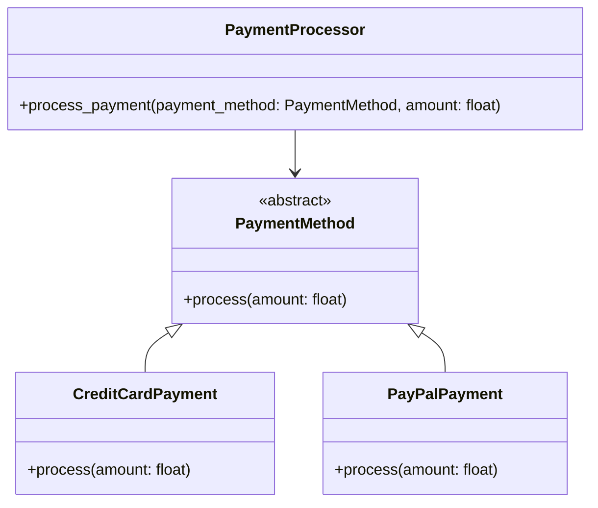

## Львівський Національний Університет Природокористування
## Кафедра Інформаційних систем та Технологій

### Звіт про виконання лабораторної роботи №14
# "Принципи проєктування програмного забезпечення"

| Виконав: студент групи ІТ-31 Смолинець М. І. |
|----------------------------------------------|
| Перевірив: Татомир А. В.                     | 

**Мета: познайомитися з найбільш поширеними сучасними принципами проєктування програмного забезпечення.**

Завдання 

1. Дати загальний опис принципів проєктування.
2. Дати детальний опис одного із принципів SOLID з наведенням прикладу коду.

**Опис принципів проектування**

Принципи проєктування програмного забезпечення визначають основні правила та рекомендації, які 
допомагають створювати стійкі, зручні в підтримці та масштабовані системи. Вони орієнтовані на 
полегшення процесу розробки та забезпечення високої якості програм. Застосування цих принципів 
знижує складність коду, сприяє зручності тестування та майбутньої модифікації систем.

Ось кілька основних принципів проєктування:
1. Принцип єдиного обов'язку (SRP): Кожен клас або модуль повинен бути відповідальний за виконання 
лише однієї функції або задачу. Це дозволяє зменшити взаємозалежність і забезпечує легкість в тестуванні та модифікації коду.

2. Принцип відкритості/закритості (OCP): Система повинна бути спроектована так, щоб можна було 
додавати нову функціональність без зміни вже існуючого коду. Це допомагає уникнути непередбачуваних помилок під час розширення функціоналу.

3. Принцип підстановки Лісков (LSP): Підкласи повинні бути взаємозамінні з базовими класами без 
порушення коректності системи, тобто, підкласи мають зберігати поведінку батьківського класу.

4. Принцип розділення інтерфейсу (ISP): Краще створювати кілька специфічних інтерфейсів, ніж один 
великий. Це дозволяє уникнути ситуацій, коли клієнт змушений використовувати функціональність, 
яка йому не потрібна.

5. Принцип інверсії залежностей (DIP): Вищі рівні системи не повинні залежати від нижчих рівнів, 
обидва рівні повинні залежати від абстракцій. Це дозволяє знижувати зв'язність компонентів.

**Опис коду**

Принцип відкритості/закритості (OCP)
Принцип відкритості/закритості означає, що програма повинна бути спроектована так, щоб можна було 
додавати нові функціональності без зміни існуючого коду. Це дозволяє зробити програму більш стабільною, 
оскільки нові функціональні можливості додаються через розширення, а не через модифікацію вже наявного 
коду. Таким чином, ризик внесення нових помилок у вже існуючі частини програми значно зменшується.

Реалізація цього принципу часто передбачає використання таких підходів як абстракція, поліморфізм та 
інтерфейси. Класичний приклад застосування OCP — це заміна умовних операторів на нові класи, що можуть 
легко розширювати функціональність, не змінюючи існуючий код.

Приклад коду:

Уявімо систему для обробки платежів, де необхідно підтримувати різні методи оплати (наприклад, 
кредитні картки, PayPal, банківські перекази). Без застосування OCP ми могли б мати [таку](./bad.py) 
реалізацію

Цей [код](./bad.py) порушує принцип відкритості/закритості, оскільки, додаючи новий метод оплати, потрібно 
змінювати існуючий метод process_payment, що підвищує ризик помилок і ускладнює тестування.

Правильніше було б зробити [так](./pay.py)
В цьому варіанті ми дотримуємося принципу OCP, оскільки тепер, щоб додати новий спосіб оплати, достатньо 
створити новий клас, що реалізує інтерфейс PaymentMethod, без зміни вже існуючого коду в PaymentProcessor. 
Це знижує ризик помилок і робить систему більш гнучкою до майбутніх розширень.

Переваги:

Зменшення змін: Нові функціональності додаються без впливу на існуючий код.
Масштабованість: Легко додавати нові методи оплати або інші розширення в систему.
Легкість у тестуванні: Окремі компоненти можна тестувати незалежно один від одного.

Рисунок UML діаграми на основі [коду.](./pay.py)

## Висновки.

На даній лабораторній роботі я ознайомився з принципом відкритості/закритості дозволяє 
створювати програмні системи, які не тільки легко масштабуються, але й розширюються 
без необхідності змінювати вже стабільний код. Це забезпечує зменшення ризику 
виникнення помилок при додаванні нової функціональності та дозволяє підтримувати код 
чистим і гнучким. Я особисто переконався в його важливості, оскільки цей принцип дає 
змогу працювати з кодом, який стає більш стійким до змін і легко підтримуваним у 
майбутньому.

Також я здобув досвід у побудові UML-діаграм для візуалізації архітектури 
програми, що допомогло краще зрозуміти взаємодію об'єктів і спростило процес
документування коду.

