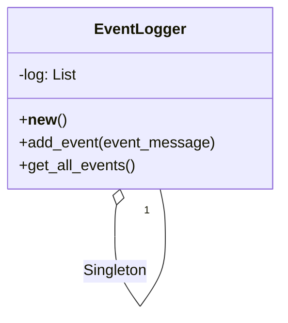

## Львівський Національний Університет Природокористування
## Кафедра Інформаційних систем та Технологій

### Звіт про виконання лабораторної роботи №11
# "Твірні шаблони проектування"

 Виконав: Тупісь Роман
|----------------------------------------------------|
 |**Перевірив: Татомир А. В.**                       

**Мета: познайомитися з групою твірних шаблонів проєктування.**

**Завдання**

1. Дати теоретичний опис твірної групи шаблонів.
2. Відповідно до индивідуального завдання:
   - дати теоретичний опис даного шаблону;
   - навести приклад коду який реалізовує даний шаблон;
   - скласти його UML-діяграму.

**Запитання для самоконтролю:**
1. Що таке твірні шаблони?
2. Які твірні шаблони Вам відомі?
3. Поясніть як реалізовано шаблон у Вашому прикладі.

**1.0**
**Теоретичний опис твірної групи шаблонів:**

Твірна група шаблонів - ці шаблони відповідають за процес створення об'єктів і спрощують їх ініціалізацію. Вони абстрагують спосіб інстанціювання об'єктів, що забезпечує незалежність коду від конкретних класів.

**2.1** 
**Загальні відомості та обов’язки:**

**Призначення:** Паттерн Singleton використовується для створення заданої кількості екземплярів (об’єктів) класу. Найчастіше він застосовується для гарантованого створення лише одного екземпляра класу.

**Обов’язки класу Singleton:**
 - Контроль кількості створених екземплярів згідно з умовами задачі.
 - Повернення потрібної кількості екземплярів за вимогою.
 - Ведення обліку отриманих екземплярів.

**Instance():** Головний метод, в якому здійснюється створення екземпляру класу та контроль за кількістю створених екземплярів. Якщо кількість екземплярів не перевищує заданого ліміту (наприклад, 1), метод повертає існуючий екземпляр класу.

**SingletonOperation():** 
Це деякий метод класу, який виконує певну роботу. Тут може бути декілька методів з будь-якими іменами, які реалізують функціонал класу.

**Переваги використання паттерну Singleton:**
 - Гарантує, що існує лише один екземпляр класу.
 - Забезпечує глобальний доступ до цього екземпляра.
 - Дозволяє контролювати створення додаткових екземплярів.

**2.2**
Повністю код наведено за [посиланням](./singleton.py).

**2.3**

**UML діаграма за твірним шаблоном singleton**

**Відповіді на питання для самоконтролю.**
1. **Що таке твірні шаблони?**

   
Твірні шаблони (creational design patterns) відповідають за створення об’єктів. Вони абстрагують процес створення об'єкта, що дозволяє системі бути незалежною від способу створення, композиції та представлення об'єктів. Це може включати управління об’єктами, які потребують складної конфігурації, або надання доступу до об'єктів без прямого їх створення.

2. **Які твірні шаблони Вам відомі?**

   
Singleton, Factory Method, Abstract Factory ,Builder ,**Prototype**

3. Клас EventLogger:

   
    Мій клас EventLogger має приватне статичне поле _instance, яке використовується для збереження єдиного екземпляра класу.
Я перевизначаю метод __new__, який викликається перед створенням нового об’єкта. У цьому методі я перевіряю, чи існує вже екземпляр класу. Якщо ні, то створюю новий екземпляр і зберігаю його в полі _instance. Якщо він вже існує, повертає існуючий екземпляр.

При створенні нового екземпляра класу я також ініціалізуєте поле log – це список, в якому я буду зберігати події.

**Методи класу:**
add_event(self, event_message): Цей метод дозволяє додавати події до списку log. Я передаю текст події як аргумент і додаю його до списку.

get_all_events(self): Цей метод повертає весь список подій, які були додані до log.

Приклад використання:
Я створюю перший екземпляр logger за допомогою EventLogger(). Потім додаю дві події до log.
Створюю ще один екземпляр another_logger, але він вже використовує той самий екземпляр, який був створений раніше. Тому я отримую ті ж самі події, які були додані до log.

## Висновки. 
Шаблон Singleton – це простий, але потужний інструмент, який дозволяє створювати лише один екземпляр певного класу. Він забезпечує глобальний доступ до цього екземпляра та дозволяє контролювати створення об’єктів. Це особливо корисно, коли вам потрібно спільно використовувати ресурси, обмежити кількість об’єктів або забезпечити ініціалізацію за вимогою.

Це не тільки технічний інструмент, але й можливість зробити ваш код більш організованим та ефективним.

