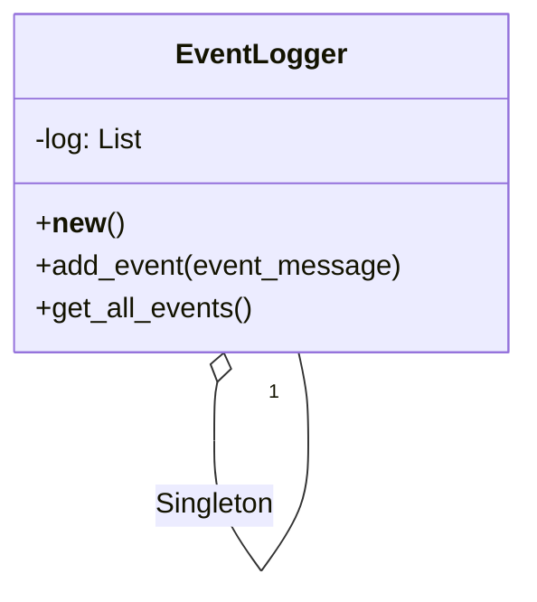

## Львівський Національний Університет Природокористування
## Кафедра Інформаційних систем та Технологій

### Звіт про виконання лабораторної роботи №11
# "Твірні шаблони проектування"

 Виконав: Роман Тупісь
|----------------------------------------------------|
 |**Перевірив: Татомир А. В.**                       

**Мета: познайомитися з групою твірних шаблонів проєктування.**

**Завдання**

1. Дати теоретичний опис твірної групи шаблонів.
2. Відповідно до индивідуального завдання:
   - дати теоретичний опис даного шаблону;
   - навести приклад коду який реалізовує даний шаблон;
   - скласти його UML-діяграму.

**1.0**
**Теоретичний опис твірної групи шаблонів:**

Твірна група шаблонів - ці шаблони відповідають за процес створення об'єктів і спрощують їх ініціалізацію. Вони абстрагують спосіб інстанціювання об'єктів, що забезпечує незалежність коду від конкретних класів.

**2.1** 
**Загальні відомості та обов’язки:**

**Призначення:** 

Паттерн Singleton використовується для створення заданої кількості екземплярів (об’єктів) класу. Найчастіше він застосовується для гарантованого створення лише одного екземпляра класу.

**Обов’язки класу Singleton:**
 - Контроль кількості створених екземплярів згідно з умовами задачі.
 - Повернення потрібної кількості екземплярів за вимогою.
 - Ведення обліку отриманих екземплярів.

**Instance():** Головний метод, в якому здійснюється створення екземпляру класу та контроль за кількістю створених екземплярів. Якщо кількість екземплярів не перевищує заданого ліміту (наприклад, 1), метод повертає існуючий екземпляр класу.

**SingletonOperation():** 
Це деякий метод класу, який виконує певну роботу. Тут може бути декілька методів з будь-якими іменами, які реалізують функціонал класу.

**Переваги використання паттерну Singleton:**
 - Гарантує, що існує лише один екземпляр класу.
 - Забезпечує глобальний доступ до цього екземпляра.
 - Дозволяє контролювати створення додаткових екземплярів.

**2.2**
Повністю код наведено за [посиланням](./singleton.py).

**2.3** **UML діаграма за твірним шаблоном singleton**

**Основні переваги Singleton:**

Контроль за доступом до ресурсу: Гарантує, що ресурс або об'єкт створюється лише один раз.
Глобальна точка доступу: Зручно отримувати доступ до екземпляра з різних частин програми.
Однак, є й недоліки:

**Складність тестування:**

Singleton може ускладнити юніт-тестування через жорстку прив'язку до конкретного класу.
Проблеми з багатопоточністю: Без належної синхронізації можуть виникати проблеми в багатопотокових середовищах.

Приклад використання:

 - Я створюю перший екземпляр logger за допомогою EventLogger(). Потім додаю дві події до log.
 - Створюю ще один екземпляр another_logger, але він вже використовує той самий екземпляр, який був створений раніше. Тому я отримую ті ж самі події, які були додані до log.

## Висновки. 

Мені подобається, що патерн Singleton забезпечує простоту управління ресурсами, уникаючи дублювання екземплярів. Це особливо корисно в ситуаціях, коли потрібен єдиний доступ до об'єкта, як-от при налаштуванні конфігурацій або веденні логів.

Крім того, Singleton спрощує структуру коду, оскільки зменшує потребу в передачі об'єкта через параметри, що робить код більш чистим і зрозумілим. Коли правильно використовується, цей патерн може бути дуже ефективним у підтримці глобального стану програми.

Однак важливо пам’ятати про потенційні недоліки, зокрема, ускладнення тестування та проблеми з багатопоточністю, що додає глибини його використанню.
