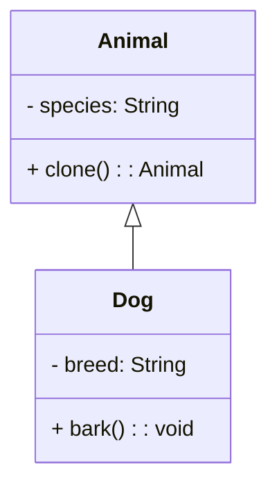

## Львівський Національний Університет Природокористування
## Кафедра Інформаційних систем та Технологій

### Звіт про виконання лабораторної роботи №12
# "Структурні шаблони проектування"

Виконав: Роман Тупісь
|----------------------------------------------------|
 |**Перевірив: Татомир А. В.**         |

**Мета: познайомитися з групою структурних шаблонів проєктування.**

**Завдання**

1. Дати теоретичний опис структурної групи шаблонів.
2. Відповідно до индивідуального завдання:
- дати теоретичний опис даного шаблону;
- навести приклад коду який реалізовує даний шаблон;
- скласти його UML-діяграму.

**Запитання для самоконтролю**
1. Що таке структурні шаблони?
2. Які структурні шаблони Вам відомі?
3. Поясніть як реалізовано шаблон у Вашому прикладі.

  
  
  

**1.0**  **Теоретичний опис структурних шаблонів проектування**

Структурні шаблони проектування — це клас шаблонів, які зосереджені на тому, як об'єкти та класи можуть бути складені в більші структури для формування нових функціональних одиниць. Основною метою структурних шаблонів є спростити та оптимізувати способи організації класів і об'єктів, забезпечуючи таким чином гнучкість, повторне використання коду та полегшуючи підтримку системи
  
  

**2.0**  **Навести приклад коду який реалізовує даний шаблон**

Повністю код наведено за [посиланням](./prototypes.py).

  
  

**3.0**  **Cкласти його UML-діяграму** 

UML діаграма для структурного класу шаблонів Prototype.
  
  
  
  

Відповіді на питання для самоконтролю.
1. **Що таке структурні шаблони?**

Структурні шаблони — це шаблони проектування, які стосуються способів організації класів та об'єктів, щоб створити складні структури з простих. Вони забезпечують способи зв'язування різних об'єктів, що дозволяє їм працювати разом, зберігаючи при цьому принципи об'єктно-орієнтованого програмування.

2.** Які структурні шаблони Вам відомі?**

Adapter, Bridge, Composite, Decorator, Facade, Flyweight , Proxy.

3. **Компоненти реалізації:**

3.1 Клас Animal:

 - Цей клас відповідає за створення об’єктів, які можуть бути клоновані.
 - Має конструктор __init__, який приймає аргумент species (вид тварини) та ініціалізує поле self.species.
 - Містить публічний метод clone(), який використовує глибоке копіювання (copy.deepcopy(self)) для створення нового об’єкта з таким самим видом тварини.

   
3.2 Створення прототипу:

 - В рядках original_dog = Animal(species="Dog") та dog1 = original_dog.clone(), ми створюємо прототип (початковий об’єкт) з видом “Dog”.
 - Метод clone() дозволяє створити копію прототипу.

   
3.3Клонування та зміна властивостей:

 - В рядках dog1 та dog2 ми клонуємо прототип, отримуючи два нових об’єкти.
 - Після цього ми змінюємо властивості цих клонованих об’єктів, встановлюючи різні породи собак.

   
3.3 Виведення результату:

   
 - В останньому рядку ми виводимо види собак, що були встановлені для dog1 та dog2.

## Висновки. 
**Корисність шаблону “Прототип”:**

Динамічне створення об’єктів: Шаблон дозволяє створювати нові об’єкти, копіюючи вже існуючі. Це особливо корисно, коли об’єкти мають складну структуру або потребують великої кількості ресурсів для ініціалізації.
Уникнення повторного створення об’єктів: Замість того, щоб створювати нові об’єкти з нуля, можна клонувати вже існуючі, що зменшує навантаження на систему.

**Випадки використання шаблону “Прототип”:**

Клонування об’єктів зі складною ініціалізацією: Якщо об’єкти мають багато полів або потребують великої кількості ресурсів для створення, прототип може значно спростити процес.
Мітотичний поділ: У біології, коли клітини діляться мітотично, вони створюють копії самих себе. Прототип може відобразити цей процес.
Кешування об’єктів: Якщо система використовує кешування для оптимізації, прототип може бути використаний для створення копій об’єктів з кешу.

**Отже , Шаблон “Прототип” дозволяє ефективно створювати копії об’єктів, уникати повторної ініціалізації та забезпечувати динамічність у створенні об’єктів.**

