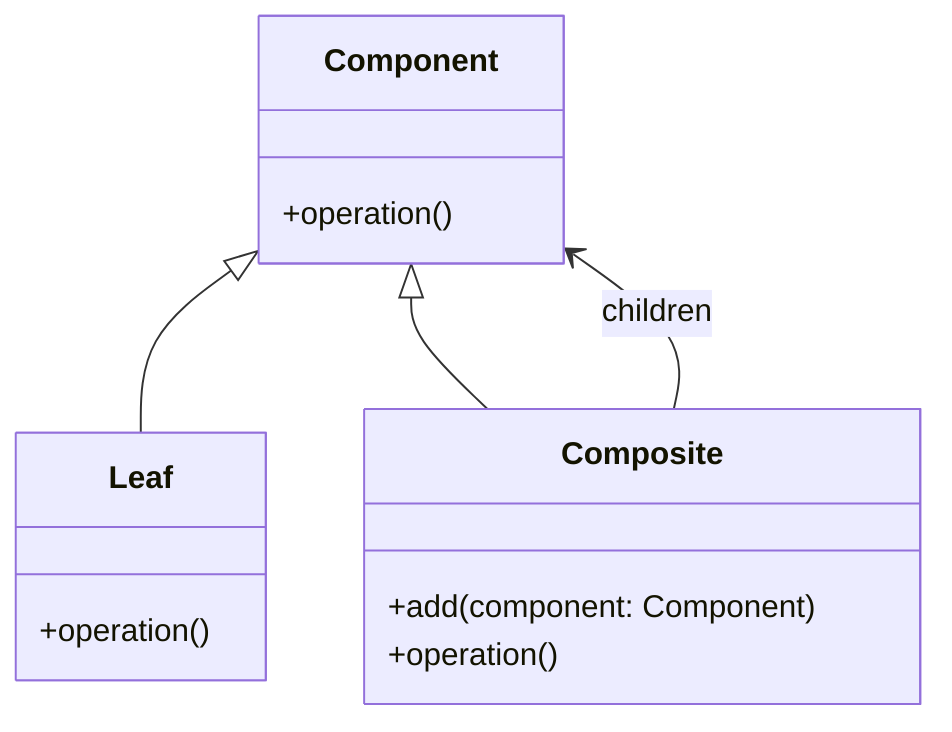

## Львівський Національний Університет Природокористування
## Кафедра Інформаційних систем та Технологій

### Звіт про виконання лабораторної роботи №12
# "Структурні шаблони проектування"

Виконав: Роман Тупісь
|----------------------------------------------------|
 |**Перевірив: Татомир А. В.**         |

**Мета: познайомитися з групою структурних шаблонів проєктування.**

**Завдання**

1. Дати теоретичний опис структурної групи шаблонів.
2. Відповідно до индивідуального завдання:
- дати теоретичний опис даного шаблону;
- навести приклад коду який реалізовує даний шаблон;
- скласти його UML-діяграму.

  
  
  

**1.0**  **Теоретичний опис структурних шаблонів проектування**

Структурні шаблони проектування — це клас шаблонів, які зосереджені на тому, як об'єкти та класи можуть бути складені в більші структури для формування нових функціональних одиниць. Основною метою структурних шаблонів є спростити та оптимізувати способи організації класів і об'єктів, забезпечуючи таким чином гнучкість, повторне використання коду та полегшуючи підтримку системи
  
  

**2.0**  **Навести приклад коду який реалізовує даний шаблон**

Повністю код наведено за [посиланням](./composite.py).

  
  

**3.0**  **UML діаграма для структурного класу шаблонів Composite.**

 
 
 

 **Компоненти реалізації:**
 

Шаблон проектування Composite дозволяє створювати дерева об'єктів, де кожен об'єкт може бути або простим (листом), або складним (композитом), який містить інші об'єкти. Ось пояснення реалізації коду на Python:

**Base Class (Component)**:
   - Це абстрактний клас, який визначає загальний інтерфейс (`operation()`) для всіх компонентів. Він встановлює контракт для підкласів.

 **Leaf Class**:
   - Реалізує `Component`. Представляє простий об'єкт (лист), який не містить інших об'єктів. В його методі `operation()` виконується певна логіка (у даному випадку просто виводиться повідомлення).

 **Composite Class**:
   - Також реалізує `Component`. Цей клас може містити дочірні компоненти (як листи, так і інші композити).
   - Містить список `children`, куди додаються компоненти через метод `add(component)`.
   - Метод `operation()` виконує свою логіку та рекурсивно викликає `operation()` для всіх дочірніх елементів.

 **Приклад використання**:
   - У головному коді (`if __name__ == "__main__":`) створюються об'єкти класів `Leaf` і `Composite`.
   - Листи додаються до композиту, і коли викликається метод `operation()` на композиті, він виведе свої повідомлення та повідомлення всіх своїх дочірніх елементів.

### Переваги:
- **Універсальність**: Дозволяє працювати з окремими об'єктами та групами об'єктів однаковим чином.
- **Гнучкість**: Легко додавати нові компоненти без зміни існуючого коду.
   

## Висновки. 
Мені подобається, що патерн Composite дозволяє створювати ієрархічні структури, що об'єднують об'єкти та їх колекції в єдину модель. Це спрощує роботу з групами об'єктів, оскільки клієнт може взаємодіяти з ними однорідно — як з окремими елементами, так і з їх композиціями.

Один із головних плюсів Composite — гнучкість у додаванні нових типів об'єктів без зміни коду, що покращує розширюваність системи. Це дозволяє легко модифікувати структуру ієрархії, що особливо корисно в складних системах, де можуть виникати різноманітні комбінації об'єктів.

Проте варто пам'ятати, що надмірне використання Composite може ускладнити розуміння структури програми, оскільки вона може стати дуже складною. Але в цілому, цей патерн є потужним інструментом для організації об'єктів у зручні та логічні структури.

**Отже , Шаблон “Прототип” дозволяє ефективно створювати копії об’єктів, уникати повторної ініціалізації та забезпечувати динамічність у створенні об’єктів.**

