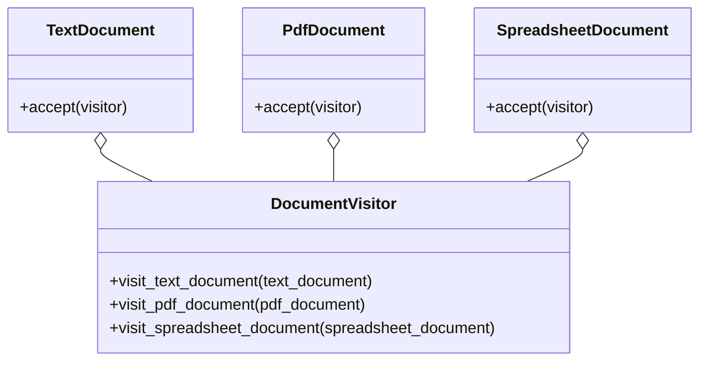

## Львівський Національний Університет Природокористування
## Кафедра Інформаційних систем та Технологій

### Звіт про виконання лабораторної роботи №13
# "Поведінкові шаблони проектування"

 Виконав: Тупісь Роман
|----------------------------------------------------|
 |**Перевірив: Татомир А. В.**      

**Мета: познайомитися з групою поведінкових шаблонів проєктування.**

**Завдання**

1. Дати теоретичний опис структурної групи шаблонів.
2. Відповідно до индивідуального завдання:
- дати теоретичний опис даного шаблону;
- навести приклад коду який реалізовує даний шаблон;
- скласти його UML-діяграму.

**Запитання для самоконтролю**
1. Що таке поведінкові шаблони?
2. Які Поведінкові шаблони Вам відомі?
3. Поясніть як реалізовано шаблон у Вашому прикладі.

  
  
  

**1.0**  **Теоретичний опис поведінкових шаблонів проектування**

Поведінкові шаблони проектування — це група шаблонів, які визначають спосіб взаємодії об’єктів та розподіл обов’язків між ними. Вони фокусуються на алгоритмах, поведінці та взаємодії об’єктів у системі. Основна мета поведінкових шаблонів — забезпечити гнучкість, легкість розширення та зменшення зв’язності між класами.

  
  

**2.0**  **Навести приклад коду який реалізовує даний шаблон**

Повністю код наведено за [посиланням](./visitor.py).

  
  

**3.0**  **Cкласти його UML-діяграму** 

UML діаграма для поведінкового класу шаблонів Visitor.
  
  
  
  

Відповіді на питання для самоконтролю.

**1.0 Що таке поведінкові шаблони?**

Поведінкові шаблони проектування — це група шаблонів, які визначають спосіб взаємодії об’єктів та розподіл обов’язків між ними. Вони фокусуються на алгоритмах, поведінці та взаємодії об’єктів у системі. Основна мета поведінкових шаблонів — забезпечити гнучкість, легкість розширення та зменшення зв’язності між класами.
 
 
**2.0 Які поведінкові шаблони Вам відомі?**

Chain of Responsibility, Command,Iterator, Mediator, Memento, Observer, Strategy, **Visitor**.
 
 
**3.0 Компоненти реалізації:**
 

**3.1 Класи документів:**
 - TextDocument, PdfDocument та SpreadsheetDocument — це класи, які представляють різні типи документів.
 - Кожен з цих класів має метод accept(visitor), який приймає об’єкт відвідувача.
 

**3.2 Клас відвідувача (DocumentVisitor):**
 - Це абстрактний клас або інтерфейс, який визначає методи для обробки різних типів документів.
 - Методи visit_text_document, visit_pdf_document та visit_spreadsheet_document відповідають за обробку відповідних типів документів.
 

**3.3 Реалізація обробки документів:**
 - У методах visit_text_document, visit_pdf_document та visit_spreadsheet_document відвідувача виконується обробка конкретного типу документа. 
Наприклад, в методі visit_text_document виводиться повідомлення “Обробка текстового документа”.
 

**3.4 Використання відвідувача:**
 - Об’єкти документів викликають метод accept(visitor), передаючи об’єкт відвідувача.
 - Відвідувач обирає відповідний метод для обробки документа.
 
 
## Висновки. 

**Патерн “Відвідувач”** — це потужний механізм, який дозволяє відокремити логіку обробки об’єктів від їх структури. Основні компоненти цього патерна включають:

Цей патерн допомагає зберегти принцип відкритості/закритості, спрощує розширення та забезпечує гнучкість системи. Він особливо корисний, коли потрібно обробляти різні типи об’єктів з однаковою логікою.
