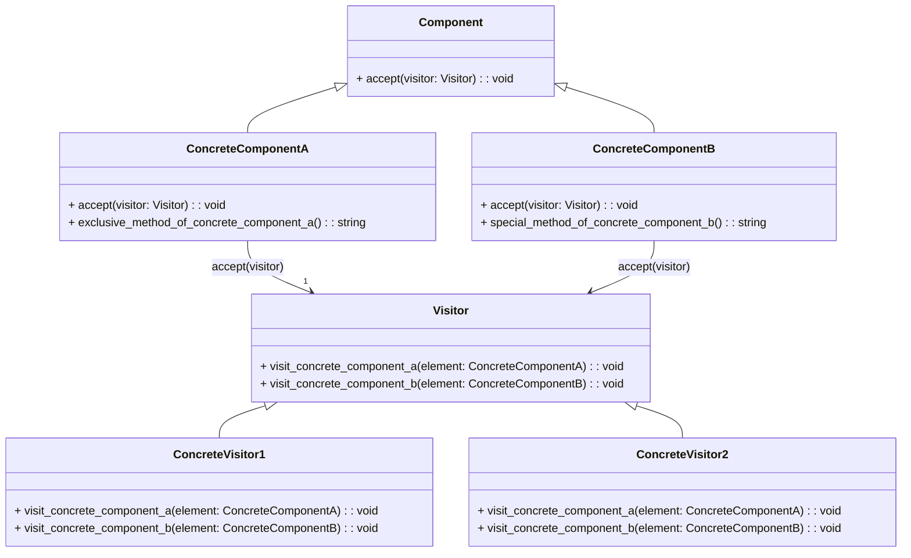

## Львівський Національний Університет Природокористування
## Кафедра Інформаційних систем та Технологій

### Звіт про виконання лабораторної роботи №13
# "Поведінкові шаблони проєктування"

| Виконав: студент групи ІТ-31 Мартиняк Назар     |
|----------------------------------------------|
| Перевірив: Андрій Володимирович Татомир               |

## Мета: познайомитися з групою поведінкових шаблонів проєктування.

## Хід роботи
1. Дати теоретичний опис поведінкової групи шаблонів
Поведінкові шаблони проектування — це група шаблонів, що спрямовані на ефективну організацію взаємодії між об'єктами, а також на управління їх поведінкою. Основна мета цих шаблонів — полегшити комунікацію між об'єктами і зробити систему більш гнучкою та масштабованою, коли справа стосується алгоритмів і контролю потоку даних.
Основні характеристики поведінкових шаблонів:
Організація взаємодії — поведінкові шаблони забезпечують ефективний спосіб взаємодії між об'єктами. Вони дозволяють уникати жорсткої прив'язки між класами та забезпечують можливість додавання нових об'єктів або функцій без зміни існуючої логіки.
2. Відповідно до индивідуального завдання:
- дати теоретичний опис даного шаблону;
Шаблон Visitor — це патерн проектування, який дозволяє додавати нову поведінку до об'єктів без зміни їхньої структури. Це досягається шляхом введення додаткового об'єкта — відвідувача (Visitor), який "відвідує" елементи об'єктної структури і виконує над ними операції.
- навести приклад коду який реалізовує даний шаблон;
Приклад коду знаходиться за цим [посиланням](1.2.py)
- скласти його UML-діяграму.

## Висновок:
На цій лабораторній роботі я засвоїв застосування принципу групою твірних шаблонів в
об’єктно-орієнтованому програмуванні. Навчився працювати з поведінковим шаблоном visitor. Написав код, який реалізує шаблон проектування Visitor , який дозволяє відокремити алгоритми (в даному випадку - способи обробки компонентів) від об'єктів, над якими ці алгоритми працюють. Створив перший раз UML діаграмму на Git Hub і запушив свою роботу на репозиторій.
